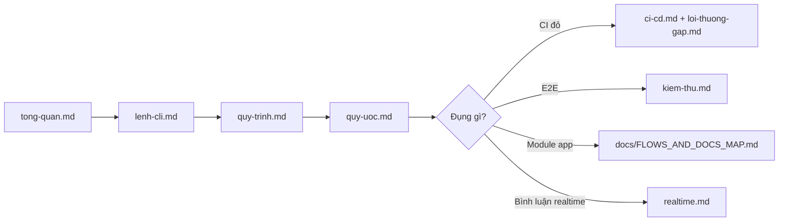

# Tài liệu tiếng Việt — `_dev/vi/`

Thư mục **giải thích bằng tiếng Việt** cho onboarding, quy trình nội bộ VAschools Workspace, và FAQ dev. Không thay thế spec kỹ thuật module — phần đó nằm ở [`docs/`](../../docs/).

---

## Quy ước hai lớp

| Lớp | Thư mục | Vai trò |
|-----|---------|---------|
| **Chuẩn (canonical)** | [`_dev/*.md`](../) | Lệnh CLI đúng từ repo, tên job CI, config thật |
| **Giải thích (VI)** | `_dev/vi/*.md` | Diễn giải, ví dụ, checklist, mẹo Windows/VN |
| **Thiết kế sản phẩm** | [`docs/*.md`](../../docs/) | Route, schema, luồng nghiệp vụ, UI map |

**Khi cập nhật:** sửa file EN (hoặc `docs/`) **trước** → rồi cập nhật file VI tương ứng. Rule: [`.cursor/rules/docs-sync.mdc`](../../.cursor/rules/docs-sync.mdc).

---

## Lộ trình đọc (dev mới)



1. [tong-quan.md](tong-quan.md) — stack, lệnh nhanh, phân biệt `_dev` vs `docs`
2. [lenh-cli.md](lenh-cli.md) — npm, artisan, Husky, Playwright
3. [quy-trinh.md](quy-trinh.md) — hàng ngày, feature, PR, deploy
4. [quy-uoc.md](quy-uoc.md) — commit, Vue/PHP, ESLint, nhập Excel
5. Khi cần: [ci-cd.md](ci-cd.md) · [kiem-thu.md](kiem-thu.md) · [loi-thuong-gap.md](loi-thuong-gap.md)

---

## Mục lục file VI ↔ gốc EN ↔ docs

| File VI | Nội dung | File gốc (EN) |
|---------|----------|---------------|
| [tong-quan.md](tong-quan.md) | Bộ nhớ `_dev/`, lệnh hay dùng | [../README.md](../README.md) |
| [lenh-cli.md](lenh-cli.md) | Toàn bộ lệnh CLI | [../commands.md](../commands.md) |
| [quy-trinh.md](quy-trinh.md) | Dev, feature, PR, deploy, hotfix | [../workflows.md](../workflows.md) |
| [quy-uoc.md](quy-uoc.md) | Commit, branch, Vue, PHP, ESLint | [../conventions.md](../conventions.md) |
| [ci-cd.md](ci-cd.md) | GitHub Actions, job, skip CI | [../ci-cd.md](../ci-cd.md) |
| [kiem-thu.md](kiem-thu.md) | PHPUnit + Playwright | [../testing.md](../testing.md) |
| [loi-thuong-gap.md](loi-thuong-gap.md) | Husky, ESLint, CI, deploy, media | [../troubleshooting.md](../troubleshooting.md) |
| [realtime.md](realtime.md) | Socket.IO bình luận | [../realtime.md](../realtime.md) |

| Tài liệu thiết kế (tiếng Việt trong app; doc chủ yếu VI/EN mix) | Đường dẫn |
|------------------------------------------------------------------|-----------|
| Hub sơ đồ luồng + map module | [docs/FLOWS_AND_DOCS_MAP.md](../../docs/FLOWS_AND_DOCS_MAP.md) |
| Tổng quan sản phẩm | [docs/PROJECT_OVERVIEW.md](../../docs/PROJECT_OVERVIEW.md) |
| Nhập · xuất · đối soát Excel | [docs/IMPORT_EXPORT_RECONCILE.md](../../docs/IMPORT_EXPORT_RECONCILE.md) |

---

## AI / Cursor / Claude

| Loại câu hỏi | Đọc trước |
|--------------|-----------|
| Lệnh, tên job CI, script trong `package.json` | `_dev/*.md` (EN) |
| Giải thích tiếng Việt, onboarding | `_dev/vi/` |
| Route, bảng DB, luồng module | `docs/` + [FLOWS_AND_DOCS_MAP](../../docs/FLOWS_AND_DOCS_MAP.md) |
| Rule agent (header, datagrid, KPI…) | `.cursor/rules/` + `.cursor/skills/` |

Thiếu nội dung → trả lời user và **đề xuất cập nhật cả EN lẫn VI** (và `docs/` nếu đổi hành vi app).

---

## Trước khi push (tóm tắt)

Thứ tự giống CI — chi tiết skill [ship-ready](../../.cursor/skills/ship-ready/SKILL.md):

```bash
vendor/bin/pint --test    # nếu đổi PHP
php artisan test          # nếu đổi backend/tests
npm run lint              # nếu đổi resources/js
npm run build
npm run test:e2e          # trước PR; không bắt buộc mỗi lần Sync
```

Push mặc định **không** chạy E2E local; tùy chọn: `npm run push:e2e`.
