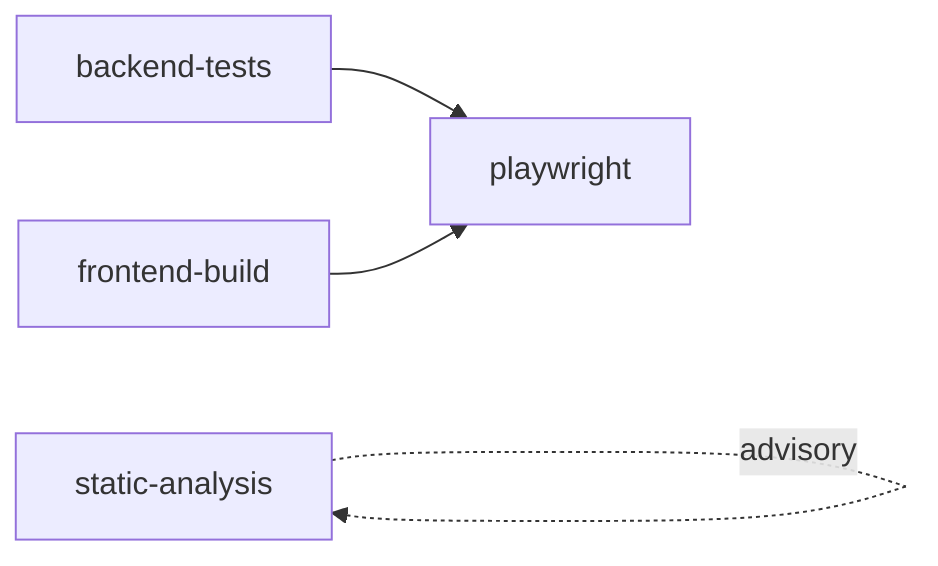

# CI/CD GitHub Actions — hướng dẫn tiếng Việt

**File gốc:** [`../ci-cd.md`](../ci-cd.md)  
**Trước push:** skill [ship-ready](../../.cursor/skills/ship-ready/SKILL.md) · rule [ci-quality-gates](../../.cursor/rules/ci-quality-gates.mdc)

Workflow: `.github/workflows/ci.yml` · GitLab mirror: `.gitlab-ci.yml`.

---

## Workflow CI

| Thuộc tính | Giá trị |
|------------|---------|
| File | `.github/workflows/ci.yml` |
| Tên | `CI` |

### Kích hoạt

| Sự kiện | Nhánh |
|---------|-------|
| `push` | `main`, `master`, `develop` |
| `pull_request` | → các nhánh trên |
| `workflow_dispatch` | Chạy tay trên GitHub Actions |

**Concurrency:** push mới cùng ref → hủy run đang chạy (`cancel-in-progress: true`).

### Biến môi trường global

| Biến | Giá trị |
|------|---------|
| `APP_ENV` | `testing` |
| `APP_DEBUG` | `true` |
| `APP_URL` | `http://127.0.0.1:8000` |

SQLite E2E chỉ trên job `playwright`. Job PHPUnit dùng stub Vite trong `tests/TestCase.php` (không `npm build` trong job PHP).

---

## Job — blocking vs advisory

### 1. `backend-tests` — **chặn merge**

| Bước | Lệnh |
|------|------|
| Chuẩn bị | `cp .env.example .env`, `key:generate` |
| Style | `vendor/bin/pint --test` |
| Test | `php artisan test` |

### 2. `frontend-build` — **chặn merge**

| Bước | Lệnh |
|------|------|
| Cài | `npm ci` |
| Lint | `npm run lint` |
| Build | `npm run build` |

> ESLint **có trên CI** (không chỉ pre-commit local).

### 3. `playwright` — **chặn merge**

**Cần:** `backend-tests` + `frontend-build` pass.

| Bước | Ghi chú |
|------|---------|
| Build | `npm run build` |
| DB | `database/testing.sqlite`, `migrate:fresh --seed` |
| Chạy | `npm run test:e2e`, `CI=true` |

Fail → artifact `playwright-report/`, `test-results/` (7 ngày).  
Config: `workers: 1`; reuse server chỉ khi `PLAYWRIGHT_REUSE_SERVER=1`.

### 4. `static-analysis` — **chỉ cảnh báo**

PHPStan — `continue-on-error: true`, không chặn merge.

---

## Sơ đồ phụ thuộc

---

## Deploy

**Không có job deploy.** CI chỉ validate chất lượng.

---

## Local vs CI

| Check | Local | CI |
|-------|-------|-----|
| Pint | `vendor/bin/pint --test` trước push PHP | `backend-tests` |
| ESLint | pre-commit + `npm run lint` | `frontend-build` |
| PHPUnit | `php artisan test` | `backend-tests` |
| Build | `npm run build` | `frontend-build` |
| E2E | Tùy chọn; `npm run push:e2e` | `playwright` |
| PHPStan | `composer analyse` | advisory |

---

## Bỏ qua CI

Commit message: `[skip ci]` hoặc `[ci skip]`.

**Không** bỏ Husky trừ `--no-verify`. Pre-push local **mặc định không** chạy E2E dù skip CI.

---

## Khi CI fail

1. GitHub → **Actions** → run lỗi
2. Mở job đỏ → đọc log
3. **Re-run failed jobs**
4. Playwright → tải artifact báo cáo

Gợi ý xử lý: [loi-thuong-gap.md](loi-thuong-gap.md).

---

## Liên quan

- [kiem-thu.md](kiem-thu.md) — PHPUnit, spec E2E, visual
- [lenh-cli.md](lenh-cli.md) — lệnh tương đương local
