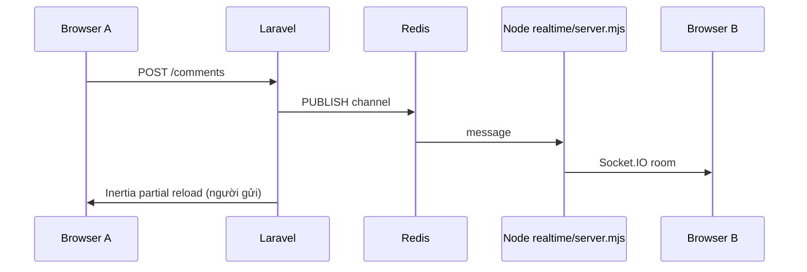

# Trao đổi realtime (Socket.IO) — tiếng Việt

**File gốc (config đầy đủ):** [`../realtime.md`](../realtime.md)  
**Lệnh:** [`lenh-cli.md`](lenh-cli.md) — `npm run realtime`

Bình luận **vướng mắc**, **task**, feedback, KB, … — hai người cùng thread có thể thấy tin mới **không F5** khi stack realtime bật.

---

## Kiến trúc (tóm tắt)



| Thành phần | Vị trí |
|------------|--------|
| Publish | `App\Support\Realtime\CommentRealtimePublisher` |
| Token subscribe | `GET /realtime/thread-token` |
| Client | `useCommentRealtime.js`, `commentRealtimeHub.js` |
| UI | `CommentThread.vue` — badge **Realtime** (xanh) |
| Node | `realtime/server.mjs` — `npm run realtime` |

Props Inertia: `realtime.enabled`, `realtime.url` (`REALTIME_CLIENT_URL`).

---

## Hai người có thấy ngay không?

**Có** khi đủ:

1. `.env`: `REALTIME_ENABLED=true`, Redis chạy, `REALTIME_SECRET` trùng Laravel ↔ Node
2. Process Node luôn bật (dev: terminal; prod: systemd)
3. Reverse proxy chuyển `/socket.io/` → `127.0.0.1:6001`
4. Cả hai mở **cùng** entity → tab bình luận → badge **Realtime**

**Fallback:** Realtime tắt/lỗi → người **gửi** vẫn thấy tin (Inertia reload); người **xem** cần F5 hoặc sửa stack.

---

## Dev local (2 trình duyệt)

1. `.env` mẫu:

```env
REALTIME_ENABLED=true
REALTIME_SECRET="${APP_KEY}"
REALTIME_REDIS_CHANNEL=va-qlda:realtime
REALTIME_CLIENT_URL=http://127.0.0.1:8000
REALTIME_SERVER_PORT=6001
REDIS_HOST=127.0.0.1
REDIS_PORT=6379
```

2. Redis chạy  
3. Ba process: `php artisan serve` · `npm run dev` · `npm run realtime`  
4. Proxy local `/socket.io` → `:6001` **hoặc** `REALTIME_CLIENT_URL=http://127.0.0.1:6001` (CORS trong `realtime/server.mjs`)  
5. Hai tài khoản → cùng vướng mắc → tab **Trao đổi**

---

## Production — checklist

### Biến môi trường

```env
REALTIME_ENABLED=true
REALTIME_SECRET="${APP_KEY}"
REALTIME_REDIS_CHANNEL=va-qlda:realtime
REALTIME_CLIENT_URL=https://your-domain.example
REALTIME_SERVER_PORT=6001
```

`REALTIME_CLIENT_URL` = URL trình duyệt dùng mở Socket.IO (thường **cùng domain** app qua proxy).

### Node service (systemd)

```bash
npm ci --omit=dev
sudo systemctl enable --now va-qlda-realtime
sudo journalctl -u va-qlda-realtime -f
```

Log mong đợi: subscribed channel + `Socket.IO on :6001`. Ví đụ unit file: [`../realtime.md`](../realtime.md).

### Nginx — proxy WebSocket

Thiếu block này → browser gọi `/socket.io` nhưng Laravel trả HTML 404 → realtime im lặng fail.

```nginx
location /socket.io/ {
    proxy_pass http://127.0.0.1:6001;
    proxy_http_version 1.1;
    proxy_set_header Upgrade $http_upgrade;
    proxy_set_header Connection "upgrade";
    proxy_set_header Host $host;
    proxy_read_timeout 86400;
}
```

Verify:

```bash
curl -I "https://YOUR_APP/socket.io/?EIO=4&transport=polling"
```

### OpenLiteSpeed / LiteSpeed (VA)

External processor + context `/socket.io/` → `127.0.0.1:6001`. **Bật WebSocket** trên vhost. Chi tiết snippet: [`../realtime.md`](../realtime.md) §3b.

**WebSocket fail, polling OK:** có thể dùng long-polling; production có thể `REALTIME_WEBSOCKET=false` cho đến khi proxy `wss` ổn.

---

## Kiểm tra nhanh

| Bước | Kỳ vọng |
|------|---------|
| GET `/realtime/thread-token?type=blocker&id=1` (đã login) | 200 + `token` |
| Tab Trao đổi | Badge **Realtime** xanh |
| `redis-cli SUBSCRIBE va-qlda:realtime` | JSON khi post comment |
| User B | Thấy comment của A không reload |

---

## Lỗi thường gặp

| Triệu chứng | Nguyên nhân | Hướng xử lý |
|-------------|-------------|-------------|
| Không badge Realtime | `REALTIME_ENABLED=false` | Bật env, `config:clear` |
| WS 404 HTML Laravel | Thiếu proxy | Nginx/LiteSpeed § trên |
| Một người thấy, một không | Node/Redis tắt | `systemctl`, `redis-cli ping` |
| Console WebSocket failed | Proxy chưa bật WS | LiteSpeed Enable WebSocket hoặc `REALTIME_WEBSOCKET=false` |

Chi tiết thêm: [loi-thuong-gap.md](loi-thuong-gap.md#realtime-binh-luan).

---

## Bảo mật (tóm tắt)

Token ký (`ThreadSubscribeToken`) + policy `CommentThreadAuthorizer`. Node verify HMAC `REALTIME_SECRET`. CORS Node theo `APP_URL`.
