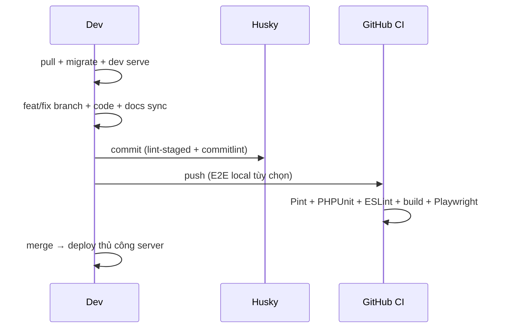

# Tổng quan — bộ nhớ dự án `_dev/`

**File gốc:** [`../README.md`](../README.md) · **Mục lục VI:** [`README.md`](README.md)

---

## `_dev/` dùng để làm gì?

**Bộ nhớ vận hành** — lệnh, quy trình git, CI, test, xử lý lỗi thường gặp. Mục tiêu: dev (và AI) không phải mò `package.json`, `.husky/`, `.github/workflows/` mỗi lần.

| Cần biết | Đọc |
|----------|-----|
| Cách chạy app, lint, test | `_dev/vi/lenh-cli.md` |
| Feature → PR → deploy | `_dev/vi/quy-trinh.md` |
| **Thiết kế module, route, sơ đồ luồng** | [`docs/FLOWS_AND_DOCS_MAP.md`](../../docs/FLOWS_AND_DOCS_MAP.md) + `docs/*.md` |
| Đồng bộ doc khi sửa code | `.cursor/rules/docs-sync.mdc` |

---

## Cấu trúc repo (tài liệu)

```
va-workspace/
├── docs/              ← spec kỹ thuật, route, DB, luồng mermaid
├── _dev/              ← vận hành dev (EN canonical)
│   └── vi/            ← giải thích tiếng Việt (thư mục này)
├── .cursor/           ← rule & skill cho Cursor
├── routes/web/        ← nguồn sự thật URL (16 partial Inertia + JSON)
└── resources/js/      ← Vue 3 + Inertia
```

---

## Stack tóm tắt

| Lớp | Công nghệ |
|-----|-----------|
| Backend | Laravel 10, PHP 8.1+, MySQL (`va_prd_*`) |
| Frontend | Vue 3 + Vite + Inertia, Tailwind |
| Auth | Guard `system`, roles `admin` \| `lead` \| `member` \| `viewer` |
| Chất lượng | ESLint (pre-commit + CI), Pint (CI), PHPStan (cảnh báo), Playwright (CI) |
| CI | `.github/workflows/ci.yml` |
| Hook | Husky — pre-commit lint, commit-msg commitlint |

---

## Lệnh copy-paste (hàng ngày)

```bash
npm run dev                              # Vite HMR
php artisan serve                        # http://127.0.0.1:8000
npm run lint                             # ESLint — warning = fail
composer test                            # PHPUnit
npm run build                            # Trước PR / sau đổi frontend
npm run test:e2e                         # E2E (CI bắt buộc; local trước PR)
php artisan migrate                      # Sau git pull có migration
npm run prepare                          # Cài lại Husky nếu hook không chạy
```

---

## Luồng làm việc ngắn



1. `git pull` → `npm install` / `composer install` nếu lock đổi → `php artisan migrate`
2. Hai terminal: `npm run dev` + `php artisan serve`
3. Nhánh `feat/…` hoặc `fix/…` → code → **cập nhật `docs/`** nếu đổi route/schema/UI module
4. Commit (Husky) → push → mở PR
5. CI pass → squash merge → deploy thủ công (xem [quy-trinh.md](quy-trinh.md))

---

## Ghi chú quan trọng

| Chủ đề | Thực tế |
|--------|---------|
| Deploy | **Không** có workflow deploy trong repo — merge xong deploy tay (ServBay / SSH…) |
| ESLint | Pre-commit (staged) **và** job CI `frontend-build` (`npm run lint`) |
| Pint | **Chặn merge** trong job `backend-tests` (`vendor/bin/pint --test`) |
| PHPStan | CI advisory — nên sửa nhưng không chặn merge |
| Pre-push E2E | **Mặc định tắt** — Sync nhanh; bật: `RUN_E2E_ON_PUSH=1` hoặc `npm run push:e2e` |
| Copy app | UI, flash, validation: **tiếng Việt** |
| Commit message | **Conventional Commits** (tiếng Anh), commitlint enforce |

---

## Cập nhật tài liệu

| Thay đổi | Cập nhật |
|----------|----------|
| npm script, Husky, job CI | `_dev/commands.md` + `_dev/ci-cd.md` + file VI tương ứng |
| Route, migration, module | `docs/` (xem docs-sync) |
| Chỉ giải thích cho team VN | `_dev/vi/*.md` |
