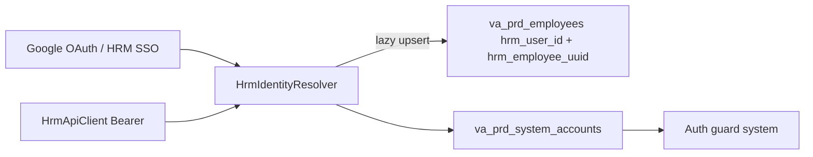
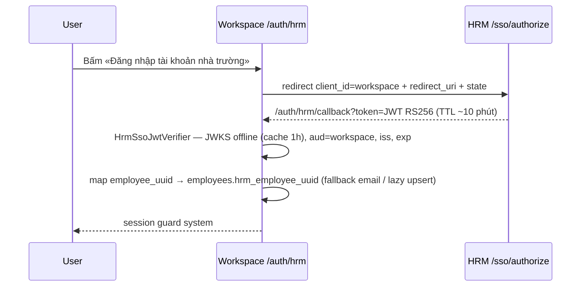

# ARCHITECTURE — VA Workspace

> Sơ đồ vận chuyển request & bản đồ module: [`FLOWS_AND_DOCS_MAP.md`](FLOWS_AND_DOCS_MAP.md).

---

## 1. Kiến Trúc Hiện Tại

Dự án áp dụng **Hybrid Architecture**: Clean Architecture cho DailyReport (module doc: [`DAILY_REPORT.md`](DAILY_REPORT.md)), Application Use Cases cho Project/Task (Phase 3), injectable Services cho Notification, và MVC cho các module còn lại (Blocker, Feedback, **Knowledge Base**, **Congnghe**, **AiAccount**, **Credential**, **Contract/CLM**, **Performance**, **Onboarding**).

```
app/
├── Application/
│   ├── DailyReport/          ← Use Cases (full Clean Architecture)
│   ├── Project/              ← Create, Update, Duplicate, Archive, LogWork
│   └── Task/                 ← Create, Patch, Update, BulkCreate, Import
│
├── Domain/                   ← Domain Layer (chỉ DailyReport)
│   └── DailyReport/
│
├── Services/
│   └── NotificationService.php
│
└── Http/                     ← Controllers, Requests, Resources
```

**Frontend (sau refactor Phase 2–5):**

```
resources/js/
├── Pages/              ← Inertia (lazy-loaded)
├── modules/project/    ← Feature components + config
├── shared/ui/          ← UI primitives
├── shared/composables/ ← useToast, usePermission, useFilter
├── composables/        ← Feature logic (Sprint, Project, Risk, …)
└── stores/             ← Pinia auth + ui
```

### Sơ Đồ Layer

```
┌──────────────────────────────────────────────────────┐
│                   HTTP Layer                          │
│  Routes → Controllers → Requests → Resources         │
└────────────────────────┬─────────────────────────────┘
                         │ direct call (Project, Task...)
                         │ use case injection (DailyReport)
                         │ service injection (Notification)
┌────────────────────────▼─────────────────────────────┐
│         Application Layer + Services Layer            │
│   Use Cases (DailyReport)                            │
│   app/Services/ — NotificationService (injectable)   │
│   Support/NotificationDispatcher (static bridge)     │
└────────────────────────┬─────────────────────────────┘
                         │
┌────────────────────────▼─────────────────────────────┐
│               Domain Layer                            │
│   Domain Models, Services, Exceptions                 │
│   (chỉ DailyReport — còn lại dùng App\Models)        │
└────────────────────────┬─────────────────────────────┘
                         │ Eloquent ORM
┌────────────────────────▼─────────────────────────────┐
│                Infrastructure                         │
│   MySQL, File Storage, Activity Log, Artisan Commands │
└──────────────────────────────────────────────────────┘
```

### HRM Public API — SSOT danh tính (2026-07-28)

Workspace lấy danh tính nhân sự **chỉ** qua Public API v1 (M2M Sanctum). Không còn connection `hrm_mysql` / đọc `va_hrm_*`.

| Client | Host | Vai trò |
|---|---|---|
| `mysql` (default, prefix `va_prd_`) | Workspace | Nghiệp vụ: dự án, task, báo cáo, role Workspace, session |
| `HrmApiClient` (`HRM_API_*`) | `https://hrm…/api/v1` | M2M — `GET /employees*` → lazy upsert `employees` |



- **Không fallback DB** khi API lỗi/miss — login báo lỗi HRM.
- **Không bulk sync** — các lệnh `cms:sync-*` đã gỡ.
- `HrmIdentityResolver` + `HrmApiEmployeeMapper` (map `primary_assignment` / `concurrent_assignments` → `employees.meta` HR fields); mở `/profile` gọi `refreshEmployeeIfLinked`. Smoke: `php artisan hrm:api-ping [--email=]`.
- **Workspace chỉ ánh xạ:** không chỉnh field HR hay skill matrix trên Workspace (`GET /profile` read-only; chỉnh trên VA-HRM).
- Trụ sở/cơ sở: lấy `primary_assignment.branch` → `headquarter` → `workplace`; avatar: URL tuyệt đối từ HRM (`users.avatar_url` / proxy `/avatars/{id}`), không upload avatar local trên hồ sơ Workspace.
- Env: `HRM_API_BASE_URL`, `HRM_API_TOKEN` (mint `/admin/api-clients`). **JWT SSO ≠ Bearer M2M.**

### SSO HRM → Workspace (2026-07-28, opt-in `HRM_SSO_ENABLED`)

HRM là **IdP nội bộ**: user Workspace đăng nhập Google **một lần trên HRM**; Workspace không gọi Google OAuth riêng khi SSO bật. Cần `HRM_API_*` để lazy upsert / refresh nhân sự sau JWT.



- `HrmSsoController` (`/auth/hrm`, `/auth/hrm/callback`) + `App\Services\Hrm\HrmSsoJwtVerifier`.
- Redirect URI cố định `{APP_URL}/auth/hrm/callback` — whitelist trên HRM (`client workspace`, `sso_enabled=true`).
- **JWT SSO user ≠ Bearer M2M** (`HRM_API_TOKEN`): JWT mở session; M2M gọi `/api/v1/*`.
- SSO tắt (`false`, mặc định) → nút Google trực tiếp; password login chỉ E2E/PHPUnit.

---

## 2. Các Vấn Đề Kiến Trúc Đang Tồn Tại

### 2.1 Kiến Trúc Không Nhất Quán

| Vấn Đề | Mô Tả | Mức Độ |
|---|---|---|
| ~~Clean Architecture chỉ DailyReport~~ | **Đã cải thiện:** Project/Task có Application Use Cases; Blocker vẫn MVC | 🟡 Medium |
| Domain models tách biệt với App\Models | `App\Domain\DailyReport\Models\` vs `App\Models\Project` — hai pattern song song | Medium |
| Controllers quá dày | `ProjectController@show`, `TaskController` vẫn có query phức tạp | High |

### 2.2 Coupling

| Vấn Đề | Mô Tả | Mức Độ |
|---|---|---|
| ~~Options.php God Object~~ | **Đã refactor:** `Support/Options/*` + delegate, bind AppServiceProvider | 🟢 Resolved |
| Navigation.php hardcoded | Sidebar menu hardcoded trong PHP class | Low |
| Controllers trực tiếp query Models | Một số actions vẫn query trực tiếp (show/index) | Medium |

### 2.3 Frontend Architecture

| Vấn Đề | Mô Tả | Mức Độ |
|---|---|---|
| ~~Composables thiếu~~ | **Đã cải thiện:** 25+ composables + `shared/composables/` | 🟢 Resolved |
| ~~Components chưa phân tầng~~ | **Đã migrate:** `modules/project/`, `shared/ui/` | 🟢 Resolved |
| ~~Không có global state~~ | **Đã thêm:** Pinia `stores/auth.js`, `stores/ui.js` | 🟡 Partial |
| Không có API service layer | HTTP calls inline Inertia/axios — chưa có `services/http.js` | Medium |
| Notification JSON API | `NotificationController` trả JSON — intentional exception | Medium |

### 2.4 Dependency Issues

| Vấn Đề | Mô Tả | Mức Độ |
|---|---|---|
| api.php rỗng | Không có REST API — toàn bộ đi qua Inertia routes. Khó tích hợp mobile/third-party sau này | Low |
| Không có Event/Listener pattern | Không dùng Laravel Events, logic như "send notification when task done" sẽ khó thêm sau | Medium |
| Không có Queue | Background jobs chưa được thiết lập | Low |

---

## 3. Kiến Trúc Đề Xuất Mới

### 3.1 Target Architecture: Feature-Based Layered Architecture

```
Backend (Laravel):
┌─────────────────────────────────────────────────────────────┐
│                     HTTP Layer                               │
│  routes/ → Controllers → FormRequests → Resources           │
│  (Controllers = thin orchestrators only)                     │
└────────────────────────────┬────────────────────────────────┘
                             │
┌────────────────────────────▼────────────────────────────────┐
│                  Application Layer                            │
│  app/Application/{Feature}/                                  │
│  Use Cases per feature: Project, Task, Sprint, Blocker...   │
│  (Business rules, no HTTP/DB coupling)                       │
└────────────────────────────┬────────────────────────────────┘
                             │
┌────────────────────────────▼────────────────────────────────┐
│                   Domain Layer                                │
│  app/Domain/{Feature}/                                       │
│  Entities, Value Objects, Domain Services, Exceptions        │
│  (Pure PHP, no framework dependencies)                       │
└────────────────────────────┬────────────────────────────────┘
                             │
┌────────────────────────────▼────────────────────────────────┐
│                Infrastructure Layer                           │
│  Eloquent Repositories, File Storage, Mail, Queue            │
│  (Framework-dependent implementations)                       │
└─────────────────────────────────────────────────────────────┘

Frontend (Vue 3):
┌─────────────────────────────────────────────────────────────┐
│                    Pages (Inertia)                           │
│  pages/{feature}/  — thin, composed of feature components   │
└────────────────────────────┬────────────────────────────────┘
                             │
┌────────────────────────────▼────────────────────────────────┐
│                Feature Modules                               │
│  modules/{feature}/                                          │
│  Components + Composables + Services per feature            │
└────────────────────────────┬────────────────────────────────┘
                             │
┌────────────────────────────▼────────────────────────────────┐
│                  Shared Layer                                 │
│  shared/ui/     — Primitives: Button, Modal, Badge           │
│  shared/        — Composables, types, constants, utils       │
└────────────────────────────┬────────────────────────────────┘
                             │
┌────────────────────────────▼────────────────────────────────┐
│                   Stores (Pinia)                             │
│  stores/auth, stores/ui (toast, dialog)                     │
└─────────────────────────────────────────────────────────────┘
```

### 3.2 Module Boundaries Đề Xuất

```
Feature Modules:
┌──────────────────┬──────────────────┬──────────────────┐
│   Project        │   DailyReport    │   People         │
│   ─────────      │   ──────────     │   ──────         │
│   Project        │   Report         │   Employee       │
│   Sprint         │   Score          │   Department     │
│   Task           │   Review         │   SystemAccount  │
│   Epic           │                  │                  │
│   Worklog        │                  │                  │
│   Attachment     │                  │                  │
│   Member         │                  │                  │
└──────────────────┴──────────────────┴──────────────────┘
┌──────────────────┬──────────────────┬──────────────────┐
│   IssueTracking  │   Communication  │   Auth           │
│   ────────────   │   ─────────────  │   ────           │
│   Blocker        │   Comment        │   Login          │
│   Bug            │   Reaction       │   Session        │
│   Feedback       │                  │   Permission     │
└──────────────────┴──────────────────┴──────────────────┘
```

---

## 4. Dependency Map Hiện Tại

```
Models (App\Models):
Project ──→ Employee (manager, members)
Project ──→ Department
Sprint  ──→ Project
Epic    ──→ Project
Task    ──→ Project, Sprint, Epic, Employee (assignee, reporter, reviewer)
Task    ──→ Task (parent/subtasks, dependencies)
Worklog ──→ Task, Employee
Blocker ──→ Project, Task, Employee
Bug     ──→ Project, Task, Employee
Feedback──→ Project, Employee
Comment ──→ (polymorphic) Task, Bug, Blocker, Feedback

Domain Models (App\Domain):
DailyReport  ──→ Employee
DailyReportScore ──→ DailyReport, Employee

Support:
Options.php ──→ Employee, Project, Department (direct Model coupling)
Navigation.php ──→ SystemAccount (role-based, định nghĩa thuần)
NavigationBadges.php ──→ NotificationService, CongngheSoftwareProposal (đếm badge nav)
TaskActivityLogger.php ──→ Task, Employee
BlockerActivityLogger.php ──→ Blocker, Employee
```

---

## 5. Layer Responsibilities

| Layer | Trách Nhiệm | KHÔNG nên làm |
|---|---|---|
| **Controllers** | Nhận HTTP request, validate qua Form Request, gọi Use Case / Model, trả Resource | Không chứa business logic, không query trực tiếp |
| **Form Requests** | Validate input, authorize request | Không transform data, không query ngoài validation rules |
| **Use Cases** | Orchestrate business flow, gọi Domain Services | Không biết về HTTP, không format response |
| **Domain Models** | Business rules, domain logic, relationships | Không biết về HTTP layer, không format response |
| **Resources** | Format response data cho client | Không chứa business logic |
| **Policies** | Authorization rules | Không chứa business logic |
| **Support** | Utility functions, shared helpers | Không chứa business logic của feature |
