# TỔNG HỢP NGHIỆP VỤ & CHỨC NĂNG — VA WORKSPACE

> **VA Workspace** (VAschools Quản Lý Dự Án) — nền tảng quản lý công việc, dự án và hiệu suất nhân sự nội bộ dành cho VAschools.
> Tài liệu này là **bức tranh tổng thể (big picture)** hợp nhất từ toàn bộ `docs/*.md` + `routes/web/*.php` + `app/Models/` — dùng để onboarding nhanh, thuyết trình nghiệp vụ, hoặc làm điểm tra cứu duy nhất.
> Cập nhật: 2026-08-24 · Nguồn: `docs/PROJECT_OVERVIEW.md`, `docs/FLOWS_AND_DOCS_MAP.md`, `docs/DATABASE_STRUCTURE.md`, `docs/PERMISSIONS.md` và các doc module liệt kê ở §12.

---

## 1. Bài toán & Mục tiêu

VA Workspace giải quyết các vấn đề vận hành thực tế của VAschools:

| # | Bài toán | Giải pháp (module) |
|---|---|---|
| 1 | Theo dõi tiến độ dự án phân tán, không có nguồn sự thật chung | **Project Management** — Project, Sprint, Task, Gantt, Calendar |
| 2 | Không có kênh báo cáo ngày chuẩn hóa, khó chấm điểm nhân viên | **Daily Report** — viết → nộp → chấm điểm 5 tiêu chí → xếp loại A–F |
| 3 | Khó quản lý vướng mắc/rủi ro trong dự án | **Blocker** (UI: Vướng mắc) — severity + owner + recheck |
| 4 | Thiếu bộ kiểm thử QA chuẩn hóa theo dự án | **Test Case / Test Suite** (UI: QA / Test case) |
| 5 | Thiếu kênh phản hồi/đề xuất từ nhân viên | **Feedback** |
| 6 | Không đo được chi phí nhân công thực tế theo giờ | **Worklog** gắn `rate_snapshot` theo từng dự án |
| 7 | Quản lý nhân sự theo phòng ban rời rạc | **Department + Employee**, đồng bộ SSOT từ **HRM** |
| 8 | Hợp đồng/NCC quản lý rải rác, quên hạn gia hạn | **Contract Lifecycle Management (CLM)** |
| 9 | Mật khẩu/tài khoản hạ tầng thiếu kiểm soát, không audit | **Credential Vault** — phân quyền + nhật ký truy cập |
| 10 | Không đo được hiệu suất nhân sự khách quan | **Performance Analytics** — KPI dashboard + audit cá nhân |
| 11 | Tri thức nội bộ phân mảnh, khó tìm | **Knowledge Base** — wiki nội bộ có tag/category/search |
| 12 | Quản lý tài khoản AI/công cụ rải rác, không rõ chi phí | **AI Accounts** — PĐX → mua → theo dõi chi phí/hết hạn |
| 13 | Không có nơi tổng hợp việc cá nhân xuyên nhiều dự án | **My Today's Work** (`/my-work`) |
| 14 | Thiếu audit trail bảo mật xuyên module | **Audit Trail** (`/audit`) |
| 15 | Người dùng mới khó làm quen hệ thống | **Onboarding Tour** (driver.js theo vai trò) |
| 16 | Đánh giá nhân sự thủ công, không có form chuẩn | **Evaluation Config/Forms** — tiêu chí, mẫu, phiếu, hội đồng chấm |
| 17 | Không có báo cáo tuần tự động cho lãnh đạo | **Weekly Reports** — Executive Dashboard tự sinh theo heuristic |

---

## 2. Bản đồ toàn bộ Module

```
VA Workspace
├── [AUTH]              Xác thực — guard "system", SSO qua HRM hoặc Google trực tiếp
├── [NOTIFICATION]       Thông báo in-app (bell, drawer, preferences) — fan-out tập trung
├── [PROJECT]            Dự án · Sprint · Epic · Task · Worklog · Gantt/Calendar · Documents · Members
├── [DAILY REPORT]       Báo cáo ngày: tạo → nộp → chấm điểm → xếp loại
├── [ROUTINE TASK]       Việc thường xuyên/lặp lại — không gắn Project/cost
├── [BLOCKER]            Vướng mắc / rủi ro dự án (RSK-001)
├── [TEST CASE]          QA / Test case theo dự án (TC-001)
├── [FEEDBACK]           Góp ý & đề xuất từ nhân viên (FB-0001)
├── [COMMENT]            Thảo luận đa hình (Task, Blocker, Feedback, KB…)
├── [DEPARTMENT]         Phòng ban (model + mutate API; đồng bộ dần từ HRM)
├── [SYSTEM CONFIG]      Cấu hình hệ thống, thông báo, phân quyền — super-admin-only
├── [EVALUATION CONFIG]  Tiêu chí / mẫu / phiếu đánh giá nhân sự
├── [WORKSPACE CONFIG]   Hub cấu hình scoped theo phòng ban
├── [CÔNG NGHỆ]          Landing bộ phận CNTT, đề xuất phần mềm, quản trị nội dung
├── [PROFILE]            Hồ sơ cá nhân dạng portfolio số
├── [AI ACCOUNTS]        Tài khoản AI: PĐX → mua → chi phí → analytics
├── [DASHBOARD HUB]      Tổng quan hệ thống (/dashboard)
├── [DASHBOARD WORK]     Dashboard Công Việc (/work) — KPI + compliance báo cáo ngày
├── [MY WORK]            Việc của tôi — task cá nhân đa dự án; lead xem việc nhóm
├── [KNOWLEDGE BASE]     Tri thức nội bộ — bài viết, danh mục, tag, tìm kiếm, yêu thích
├── [CONTRACT / CLM]     Quản lý hợp đồng, NCC, chi phí, gia hạn, đánh giá NCC
├── [CREDENTIAL]         Kho tài khoản/mật khẩu hạ tầng — phân quyền + audit
├── [PERFORMANCE]        Hiệu suất & audit công việc theo nhân viên
├── [AUDIT]              Nhật ký truy vết bảo mật xuyên module (/audit)
├── [WEEKLY REPORTS]     Báo cáo tuần Executive Dashboard tự sinh theo dự án
└── [ONBOARDING]         Tour tương tác theo vai trò khi đăng nhập lần đầu
```

---

## 3. Kiến trúc hệ thống

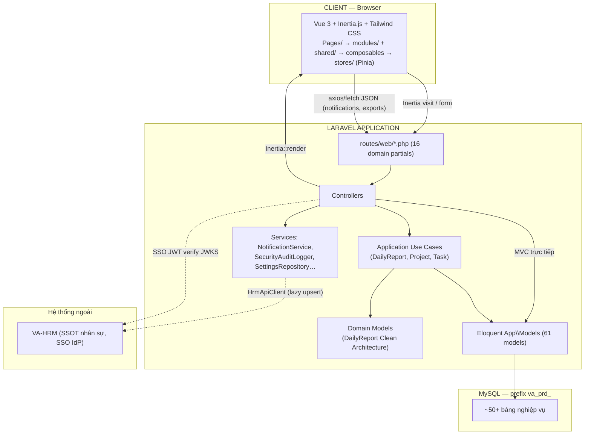

**Không có REST API chính:** `routes/api.php` rỗng. Toàn bộ giao tiếp qua Inertia (server-driven SPA); JSON chỉ dùng cho các endpoint phụ (notifications polling, exports, AI Accounts JSON API, realtime thread-token).

---

## 4. Xác thực & Phân quyền (RBAC)

### 4.1 Đăng nhập

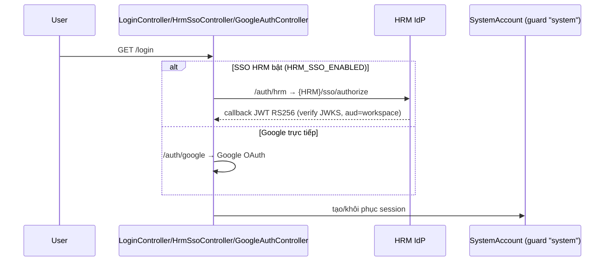

Danh tính nhân sự lấy từ **HRM Public API** (`HrmApiClient` → `HrmIdentityResolver`, lazy upsert vào `employees`). Workspace **không** đọc trực tiếp DB HRM.

### 4.2 5 vai trò hệ thống

| Role | Mô tả | Vào `/settings`? |
|---|---|---|
| `super_admin` | God-mode (`Gate::before`), toàn quyền + độc quyền ma trận phân quyền, gán role, reserved keys | ✅ (duy nhất) |
| `admin` | Toàn quyền nghiệp vụ | ❌ |
| `lead` | Quản lý nhóm: dự án, duyệt báo cáo, hợp đồng, NCC, KB | ❌ |
| `member` | Làm việc, viết báo cáo ngày, tạo test case/đề xuất/KB của mình | ❌ |
| `viewer` | Chỉ xem (dashboard, hiệu suất, hợp đồng, dự án) | ❌ |

### 4.3 Cơ chế RBAC

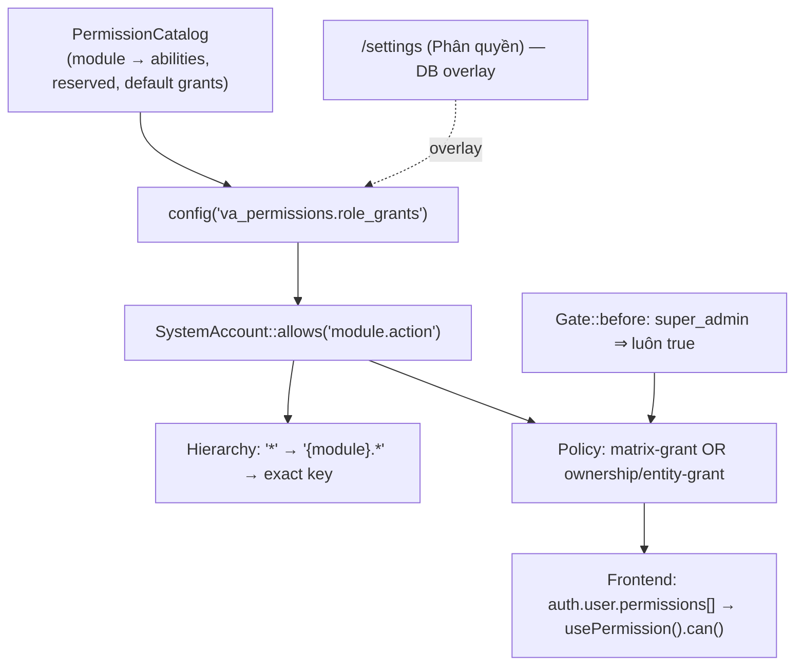

**Nguyên tắc bất biến:** quyền cuối cùng = **(matrix-grant) OR (ownership/entity-grant)** — người dùng luôn sửa được bản ghi của chính mình dù ma trận không cấp toàn cục.

**Reserved keys** (chỉ `super_admin`, bị strip khỏi mọi role khác): `system.settings.*`, `permissions.manage`, `roles.assign`, `workspace.hub.manage`, `workspace.evaluation.*`, `workspace.daily_report_scoring.*`.

Chi tiết: [`docs/PERMISSIONS.md`](PERMISSIONS.md).

---

## 5. Luồng nghiệp vụ trọng tâm

### 5.1 Quản lý dự án (Project → Sprint → Task → Cost)

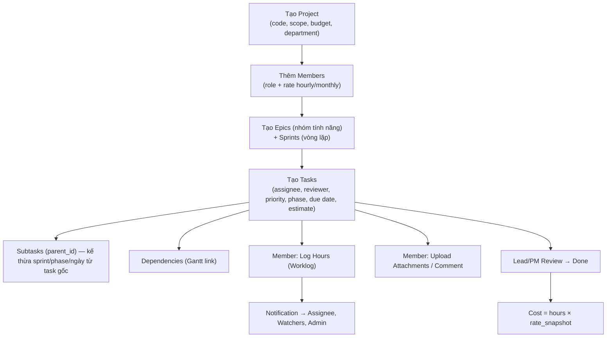

Workspace UI: các tab trong `Project/Show` — Dashboard, Sprint board (drag-drop), Gantt/Timeline (FullCalendar), Burndown, Documents, Weekly Reports.

### 5.2 Báo cáo ngày (Daily Report)

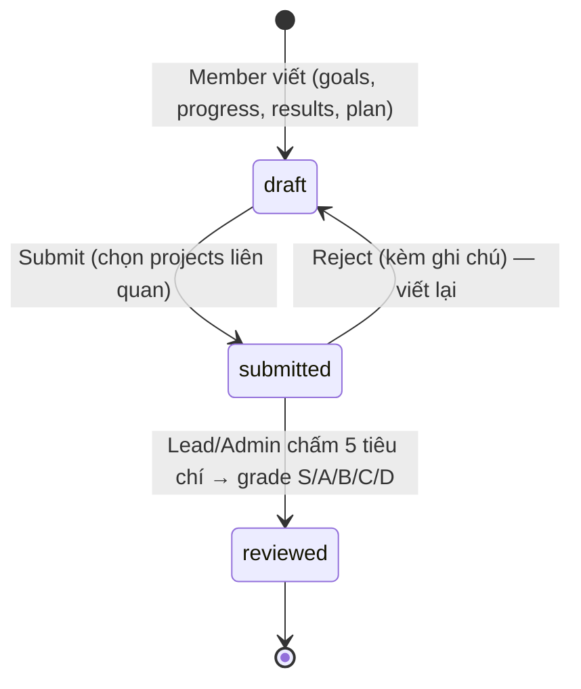

5 tiêu chí chấm: `task_completion`, `skill_score`, `attitude_score`, `kaizen_score` (bonus tối đa cấu hình được), `expertise_score` — trọng số cấu hình theo phòng ban qua `daily_report_scoring_configs`.

### 5.3 Vướng mắc / Blocker

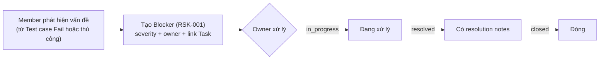

### 5.4 QA / Test case

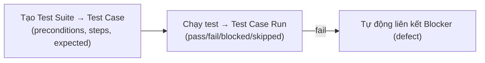

### 5.5 Nhập/Xuất/Đối soát Excel (chuẩn hoá toàn hệ thống)

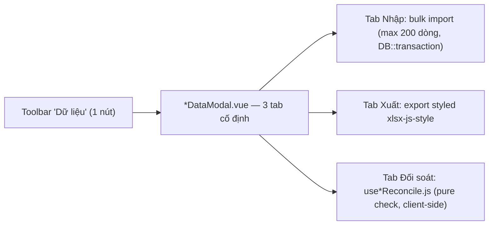

Tham chiếu vàng: Blocker (`useRiskImport/Export.js`, `RiskImportModal.vue`), Test case (`TestCaseDataModal`). Kiến trúc bắt buộc: `use*Data.js` (Excel I/O) tách khỏi `.vue` (UI) tách khỏi `use*Reconcile.js` (pure check) tách khỏi `Import*Request.php` (validate server, mirror client). Chi tiết: [`docs/IMPORT_EXPORT_RECONCILE.md`](IMPORT_EXPORT_RECONCILE.md).

### 5.6 Đề xuất phần mềm (Công Nghệ)

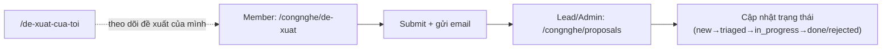

### 5.7 AI Accounts (PĐX → Tài khoản → Chi phí)

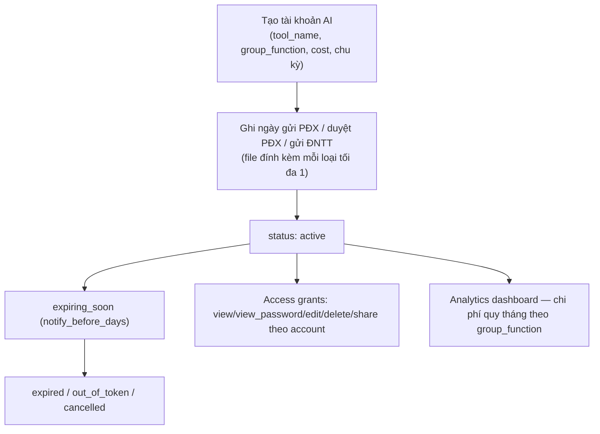

> 2026-08: model đã **flatten** — bỏ workflow phê duyệt nhiều bước (proposal/payment request/scan riêng bảng), gộp vào chính `ai_accounts` (các cột `proposal_*`, `payment_request_*`).

### 5.8 Hợp đồng / NCC (CLM)

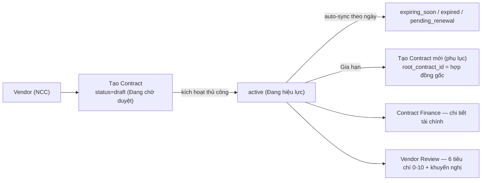

### 5.9 Đánh giá nhân sự (Evaluation)

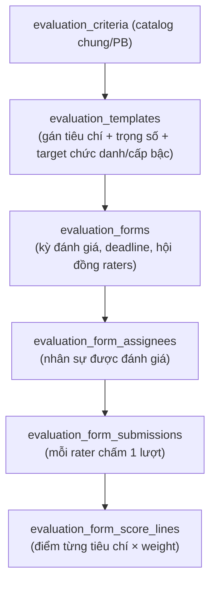

### 5.10 Weekly Reports (Executive Dashboard tự động)

Trên `Project/Show?tab=weekly` — engine heuristic (không LLM) sinh báo cáo tuần từ dữ liệu task/worklog/blocker thực tế, có workflow duyệt + version + export PDF/DOCX. Xem [`docs/WEEKLY_REPORTS.md`](WEEKLY_REPORTS.md).

---

## 6. Bản đồ route → module (tổng hợp `routes/web/*.php`)

| Domain file | Nhóm route chính | Trang chính (Vue) |
|---|---|---|
| `dashboard.php` | `/dashboard`, `/work` | `Pages/Dashboard/` |
| `projects.php` | `/projects`, sprint/task/worklog/attachment/weekly nested | `Pages/Project/`, `modules/project/` |
| `daily-reports.php` | `/daily-reports`, `/daily-reports/today`, `/daily-reports/review` | `Pages/DailyReport/`, `modules/daily-report/` |
| `routine-tasks.php` | `/routine-tasks` | `Pages/RoutineTask/`, `modules/routine-task/` |
| `blockers.php` | `/blockers`, `/blockers/import` | `Pages/Blocker/` |
| `test-cases.php` | `/test-cases`, `/test-cases/import` | `Pages/TestCase/`, `modules/testcase/` |
| `feedback.php` | `/feedback` | `Pages/Feedback/` |
| `comments.php` | polymorphic comment API | `shared` `CommentThread.vue` |
| `knowledge-base.php` | `/knowledge-base`, blog hub | `Pages/KnowledgeBase/` |
| `contracts.php` | `/contracts`, vendors, renewals, docs, cost, alerts, reports | `Pages/Contract/`, `modules/contract/` |
| `credentials.php` | `/credentials` | `Pages/Credential/`, `modules/credential/` |
| `ai-accounts.php` | `/ai-accounts`, JSON `api.ai-accounts.*` | `Pages/AiAccount/`, `modules/aiAccount/` |
| `congnghe.php` | `/congnghe`, `/congnghe/de-xuat*`, `/congnghe/proposals`, `/congnghe/quan-tri` | `Pages/Congnghe/`, `Pages/CongngheAdmin/` |
| `people.php` | Department mutate, Profile, Org (API only) | `Pages/Profile/` |
| `workspace-config.php` | `/workspace-config`, `/workspace-config/evaluation`, `/workspace-config/w/{code}` | `Pages/WorkspaceConfig/`, `modules/workspace-config/`, `modules/evaluation*` |
| `settings.php` | `/settings` (super-admin) — chung, thông báo, phân quyền, accounts, menu | `Pages/Settings/` |
| `auth.php` | `/login`, `/auth/hrm`, `/auth/google` | `Pages/Auth/` |
| `view-as.php` | Xem hệ thống dưới góc nhìn role/tài khoản khác (debug/QA, admin+) | — |
| `platform.php` | `/audit`, notifications, onboarding, realtime token | `Pages/Audit/`, `Pages/Onboarding/` |

Đầy đủ tất cả path + method: [`docs/API_STRUCTURE.md`](API_STRUCTURE.md).

---

## 7. Mô hình dữ liệu (tóm tắt quan hệ chính)

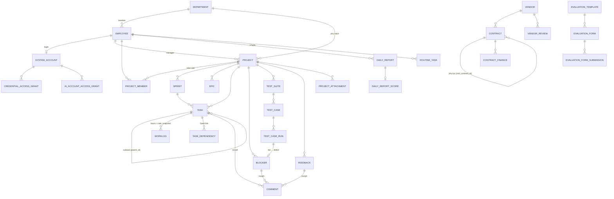

- **DB engine:** MySQL, prefix bảng `va_prd_`, ~50+ bảng.
- **Soft deletes:** `employees`, `tasks`, `contracts` (bugs đã gỡ module).
- **UUID:** `daily_reports`, `routine_tasks`, `ai_accounts`.
- **Audit tự động:** Spatie Activity Log trên các model chính + `SecurityAuditLogger` cho ledger bảo mật riêng (`/audit`).
- **Business rule cố định:** `cost = hours × rate_snapshot` (worklog); 1 báo cáo/người/ngày (`unique(employee_id, date)`); `MONTHLY_HOURS = 176` để quy đổi rate tháng → giờ.

Đầy đủ schema từng bảng: [`docs/DATABASE_STRUCTURE.md`](DATABASE_STRUCTURE.md).

---

## 8. Kiến trúc theo module (pattern code)

| Module | Pattern | Vị trí |
|---|---|---|
| Daily Report | **Clean Architecture** — Controller → Use Case → Domain Model | `app/Application/DailyReport/`, `app/Domain/DailyReport/` |
| Project, Task | **Application Use Cases** cho mutation + MVC cho read path | `app/Application/Project/`, `app/Application/Task/` |
| Blocker, Feedback, Test Case, Knowledge Base, Công Nghệ, Contract, Credential, AI Account | **MVC thuần** — Controller → Model/Support | `app/Http/Controllers/*` |
| System Config | MVC + **Settings overlay** (`SettingsSchema`/`SettingsRepository` → `config()` runtime, super-admin-only) | `app/Support/Settings/` |
| Evaluation Config | MVC | `app/Http/Controllers/WorkspaceConfig/` |

**Quy tắc:** không refactor sang Use Case khi chỉ sửa bug nhỏ; module mới ưu tiên copy pattern của module cùng loại (FormRequest + Policy + Resource).

### Frontend

| Path | Vai trò |
|---|---|
| `Pages/{Domain}/` | Inertia pages — mỏng, bọc `AppLayout` |
| `Components/Ui/` | Primitives: Modal, Drawer, PageHeader, Toast |
| `modules/{feature}/components/` | UI theo feature (project, daily-report, knowledge-base, contract, credential, aiAccount, testcase, routine-task, evaluation*, workspace-config, onboarding, audit, notifications, performance, profile) |
| `shared/ui/` | Badge, Avatar, form/* — dùng lại toàn hệ thống |
| `shared/composables/` | `useToast`, `usePermission`, `useFilter` |
| `composables/use*.js` | Logic nghiệp vụ per-feature (Excel I/O không import trong `.vue`) |
| `stores/` | Pinia — `auth.js`, `ui.js` |

---

## 9. Import/Export/Đối soát — tiêu chuẩn sản xuất

Mọi module nhập/xuất/đối soát **bắt buộc copy pattern đã chứng minh** (Blocker → Risk Import/Export):

- **Một điểm vào UI:** 1 nút toolbar "Dữ liệu" → 1 Modal → 3 tab cố định: `import` | `export` | `reconcile`.
- **Thư viện Excel:** `xlsx-js-style` — brand palette `BRAND=9A0036`, `BRAND_SOFT=FDF2F6`.
- **File mẫu Excel** có 3 sheet bắt buộc: `Huong dan` (9 mục), `Nhap lieu` (marker ẩn, header dòng 5, sample dòng 6–7, nhập từ dòng 8), `Tham chiếu` (nếu có FK).
- **Giới hạn:** max 200 dòng cả client lẫn server.
- **Validate 2 lớp:** client (composable) + server (`Import*Request` mirror rules).
- **Cấm:** 3 nút/3 modal riêng; `sheet_to_json` không kiểm marker; export không style; chỉ validate client.

Chi tiết: [`docs/IMPORT_EXPORT_RECONCILE.md`](IMPORT_EXPORT_RECONCILE.md).

---

## 10. Tech stack

| Layer | Công nghệ | Ghi chú |
|---|---|---|
| Backend | Laravel 10.10, PHP 8.1+ | `routes/web/*.php` split theo domain (loader `web.php`) |
| Frontend | Vue 3.5 + Inertia.js + Tailwind 3.4 | Vite 5.0 build |
| Database | MySQL, prefix `va_prd_` | ~50+ bảng |
| Auth | Custom guard `system` + Laravel Sanctum | SSO qua HRM (JWT RS256/JWKS) hoặc Google trực tiếp |
| Rich text | TipTap 3.24 | Daily report, KB, task description |
| Gantt/Calendar | FullCalendar (đã thay Frappe Gantt cho `/coaching` cũ và project timeline) | |
| Charts | Chart.js + Vue ChartJS | Performance, AI Accounts analytics |
| Excel | `xlsx-js-style` | Import/export chuẩn styled |
| Audit | Spatie Activity Log + `SecurityAuditLogger` riêng | |
| Code quality | Laravel Pint, PHPStan/Larastan, ESLint 9 | |
| E2E | Playwright 1.49 (Chromium) | |
| Git hooks | Husky + commitlint (Conventional Commits) | |
| CI | GitHub Actions (`.github/workflows/ci.yml`) + GitLab mirror | |
| Realtime | Socket.IO (Node server + Redis bridge) cho comment | `_dev/realtime.md` |
| Onboarding | driver.js | Tour theo vai trò |

---

## 11. Tích hợp ngoài — VA-HRM

- **SSOT nhân sự:** Workspace không lưu bản chính dữ liệu nhân sự — chỉ **cache ánh xạ** trên `employees` (`hrm_employee_uuid`, `hrm_user_id`), lazy upsert qua `HrmApiClient` (`HRM_API_BASE_URL` + `HRM_API_TOKEN`).
- **SSO:** HRM là Identity Provider nội bộ — user login Google một lần trên HRM; Workspace tin JWT từ `{HRM}/sso/authorize` (verify JWKS, `aud=workspace`). JWT SSO người dùng **khác** token M2M `HRM_API_TOKEN`.
- **Chỉnh sửa hồ sơ:** chỉ trên VA-HRM — Workspace **không ghi đè** field HR qua `/profile`.
- **Module đã gỡ do trùng HRM:** Talent Management (2026-06-15, các bảng skill/certification/KPI/learning/succession), Coaching/Mentoring (2026-07-29), Org teams UI (2026-07, bảng giữ tạm chờ HRM API), Bug tracking riêng (2026-06, dùng Feedback/Blocker thay thế).

---

## 12. Chỉ mục tài liệu chi tiết (`docs/`)

| File | Nội dung |
|---|---|
| [PROJECT_OVERVIEW.md](PROJECT_OVERVIEW.md) | Mục tiêu, module, trạng thái triển khai từng route |
| [ARCHITECTURE.md](ARCHITECTURE.md) | Layer, coupling, mục tiêu kiến trúc |
| [FOLDER_STRUCTURE.md](FOLDER_STRUCTURE.md) | Cây thư mục sau refactor |
| [FRONTEND_STRUCTURE.md](FRONTEND_STRUCTURE.md) | Pages, modules/, shared/, composables |
| [API_STRUCTURE.md](API_STRUCTURE.md) | Toàn bộ web routes chi tiết |
| [DATABASE_STRUCTURE.md](DATABASE_STRUCTURE.md) | Schema đầy đủ từng bảng `va_prd_*` |
| [FLOWS_AND_DOCS_MAP.md](FLOWS_AND_DOCS_MAP.md) | Sơ đồ luồng mermaid gốc + bản đồ doc↔code |
| [IMPORT_EXPORT_RECONCILE.md](IMPORT_EXPORT_RECONCILE.md) | Chuẩn Excel 3 tab |
| [PROJECT_MANAGEMENT.md](PROJECT_MANAGEMENT.md) | Chi tiết `/projects` |
| [DAILY_REPORT.md](DAILY_REPORT.md) / [DAILY_REPORT_TODAY.md](DAILY_REPORT_TODAY.md) / [DAILY_REPORT_PROJECTS.md](DAILY_REPORT_PROJECTS.md) | Báo cáo ngày |
| [WEEKLY_REPORTS.md](WEEKLY_REPORTS.md) | Báo cáo tuần Executive Dashboard |
| [KNOWLEDGE_BASE.md](KNOWLEDGE_BASE.md) | Wiki nội bộ |
| [TEST_CASE_QA.md](TEST_CASE_QA.md) | QA / Test case |
| [CONTRACT_MANAGEMENT.md](CONTRACT_MANAGEMENT.md) | CLM |
| [CREDENTIAL_MANAGEMENT.md](CREDENTIAL_MANAGEMENT.md) | Kho mật khẩu |
| [AI_ACCOUNTS.md](AI_ACCOUNTS.md) | Quản lý AI |
| [CONGNGHE_CONTENT.md](CONGNGHE_CONTENT.md) / [CONGNGHE_UIUX_PROPOSAL.md](CONGNGHE_UIUX_PROPOSAL.md) | Trung tâm Công Nghệ |
| [PERFORMANCE_ANALYTICS.md](PERFORMANCE_ANALYTICS.md) | Hiệu suất & audit |
| [EVALUATION_CONFIG.md](EVALUATION_CONFIG.md) | Tiêu chí/mẫu/phiếu đánh giá |
| [WORKSPACE_CONFIG.md](WORKSPACE_CONFIG.md) | Hub cấu hình theo phòng ban |
| [SYSTEM_CONFIG.md](SYSTEM_CONFIG.md) | `/settings` |
| [PERMISSIONS.md](PERMISSIONS.md) | RBAC chi tiết |
| [ONBOARDING.md](ONBOARDING.md) | Tour tương tác |
| [REFACTOR_PLAN.md](REFACTOR_PLAN.md) / [TECHNICAL_DEBT.md](TECHNICAL_DEBT.md) | Nợ kỹ thuật & roadmap |

**Vận hành dev (không phải nghiệp vụ):** `_dev/` (commands, workflows, CI/CD, testing, troubleshooting) + `_dev/vi/` (bản tiếng Việt).

---

## 13. Trạng thái triển khai (snapshot)

Giai đoạn: **Stage 2 — Feature expansion + refactor foundation complete** (Refactor Phase 1–5 hoàn thành 2026-06-03).

Tất cả module liệt kê ở §2 đã **✅ Hoàn thành** và đang chạy production, ngoại trừ:

| Mục | Trạng thái |
|---|---|
| Org teams / danh bạ UI | ❌ Đã gỡ UI (2026-07) — chờ HRM API, bảng DB giữ tạm |
| Bug Tracking (module riêng) | ❌ Đã gỡ (2026-06) — dùng Feedback/Blocker |
| Talent Management | ❌ Đã gỡ (2026-06-15) — chuyển sang HRM |
| Coaching/Mentoring | ❌ Đã gỡ (2026-07-29) — chuyển sang HRM |
| Team Dashboard | 🔄 Đang phát triển |
| Account Settings (cá nhân) | 📋 Kế hoạch |
| Công Nghệ landing public | Tạm ẩn sau login gate (`CONGNGHE_LANDING_PUBLIC=false`) — `/congnghe`, `/phongcongnghe` redirect `/dashboard`; đề xuất phần mềm vẫn hoạt động |

Bảng đầy đủ route ↔ trạng thái: [`docs/PROJECT_OVERVIEW.md`](PROJECT_OVERVIEW.md) §7.

---

*Tài liệu này tổng hợp — không thay thế các doc module chi tiết ở §12. Khi thêm/đổi route, migration, hoặc luồng UX mới, cập nhật doc module tương ứng trước, sau đó đồng bộ lại bảng ở đây nếu ảnh hưởng bức tranh tổng thể (theo checklist `FLOWS_AND_DOCS_MAP.md` §9).*
