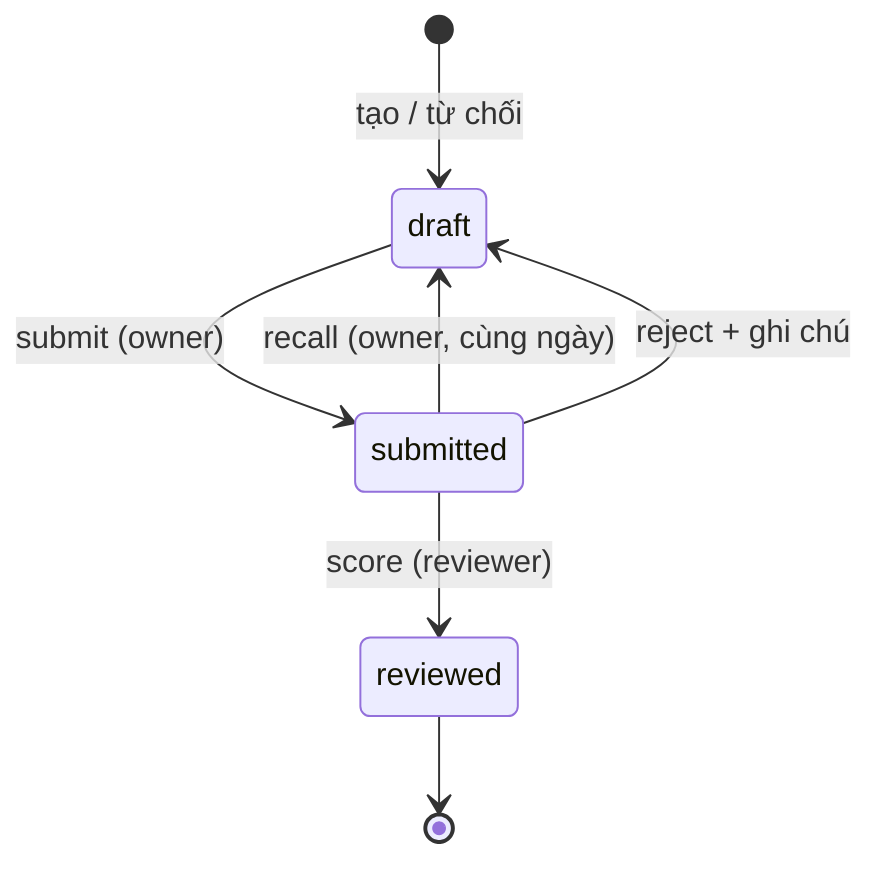

# Báo cáo ngày (Daily Report)

> Module **báo cáo công việc hằng ngày** theo khung HORENSO (報・連・相), gắn dự án/task, nộp duyệt, chấm điểm và xếp loại.  
> **Trạng thái:** ✅ Production — Clean Architecture (Use Case + Domain). Chi tiết route/UI khớp `routes/web/daily-reports.php`.

**Tài liệu liên quan:** `docs/API_STRUCTURE.md` §2 (daily-reports), `docs/DATABASE_STRUCTURE.md` §3.23–3.24, `docs/DAILY_REPORT_PROJECTS.md` (liên kết dự án & export lịch sử), `docs/FRONTEND_STRUCTURE.md` §6.6, skill `.cursor/skills/daily-report-domain/SKILL.md`.

---

## 1. Mục tiêu & phạm vi

| Mục tiêu | Mô tả |
|---|---|
| Chuẩn hóa báo cáo | Một báo cáo / nhân viên / ngày (`unique(employee_id, date)`) |
| Khung nội dung | 5 trường HTML (TipTap) + dự án đa chọn kèm task checklist |
| Vòng duyệt | Nháp → Nộp → Lead chấm điểm hoặc trả về |
| Quan sát | Lịch sử + KPI strip, tuân thủ trên dashboard `/work`, xuất Excel 7 sheet |
| Đồng bộ task | Task sinh từ báo cáo (`source=daily`); snapshot khi hoàn thành task sprint |

**Ngoài phạm vi hiện tại:** nhập Excel bulk (không có `*DataModal` 3 tab); chỉnh trọng số chấm điểm qua UI (đọc từ `config/daily_report.php`).

---

## 2. Điều hướng & màn hình

Sidebar nhóm **Báo cáo** (`App\Support\Navigation`):

| Nhãn | URL | Vai trò | Roles (nav) |
|---|---|---|---|
| Báo cáo hôm nay | `/daily-reports/today` | Form soạn / sửa nháp hôm nay | admin, lead, member |
| Lịch sử báo cáo | `/daily-reports` | Dashboard lọc + thẻ/bảng | mọi role đăng nhập |
| Chờ phê duyệt | `/daily-reports/review` | Hàng chờ chấm | admin, lead |

Trang chi tiết: `/daily-reports/{id}` (`DailyReport/Show.vue`); binding chấp nhận thêm `uuid` cho link thông báo cũ.

---

## 3. Kiến trúc backend

Module mẫu **Clean Architecture** trong VA-QLDA: controller mỏng → Use Case → Domain.

```
routes/web/daily-reports.php (prefix daily-reports.)
    → DailyReportController (index, exportData, today, store, show, update, destroy, submit, recall)
    → DailyReportReviewController (index, score, reject)

app/Application/DailyReport/          ← mutation & side effects
app/Domain/DailyReport/               ← Models, ScoringService, ReportProjectSync
app/Http/Controllers/DailyReport/
app/Http/Requests/DailyReport/
app/Http/Resources/DailyReportResource.php, DailyReportScoreResource.php
app/Policies/DailyReportPolicy.php
```

### 3.1 Use Cases

| Class | Trách nhiệm |
|---|---|
| `CreateDailyReportUseCase` | Tạo báo cáo; `ReportProjectSync::applyToPayload()` |
| `UpdateDailyReportUseCase` | Sửa nháp; sync projects; có thể gọi sync task |
| `DeleteDailyReportUseCase` | Xóa khi `isEditable()` |
| `SubmitDailyReportUseCase` | `draft` → `submitted`; cổng ngày làm việc; `is_late`; freeze task snapshot |
| `RecallDailyReportUseCase` | `submitted` → `draft` (owner tự rút lại trong ngày); nhận `?reason`; reset `submitted_at`/`is_late`/snapshot, set `recalled_at` + tăng `recall_count`; ghi `activity('daily_report')->event('recalled')` (kèm reason) + `SecurityAuditLogger::dailyReport()` — snapshot đóng băng lại khi nộp lại |
| `ScoreReportUseCase` | Chấm 5 chiều → `ScoringService` → `reviewed` + bản ghi score |
| `RejectReportUseCase` | `submitted` → `draft` + `review_notes` |
| `SyncDailyReportSpawnedTasksUseCase` | Task ad-hoc trong JSON → bảng `tasks` (`source=daily`) |

**Exception:** `DailyReportException` — controller bắt và flash tiếng Việt.

**Audit:** model `DailyReport` dùng Spatie `LogsActivity`; submit/recall/reject/score ghi thêm `activity('daily_report')`. `App\Support\DailyReportTimeline::for($report)` đọc các event vòng đời (lọc bỏ autosave `updated`) → dòng thời gian hiển thị ở `Show.vue` qua component `ReportAuditTimeline.vue`. Action `daily_report.recalled` cũng vào sổ cái `/audit` (xem `AuditActionCatalog`).

### 3.2 Domain & support

| Thành phần | Vai trò |
|---|---|
| `Domain/DailyReport/Models/DailyReport` | UUID, cast `projects`, `task_status_snapshot`, `ReportStatus` |
| `Domain/DailyReport/Models/DailyReportScore` | 1–1 với báo cáo đã chấm |
| `Domain/DailyReport/Services/ScoringService` | Tổng có trọng số + bonus Kaizen → `Grade` |
| `Domain/DailyReport/Support/ReportProjectSync` | Đồng bộ `projects` JSON ↔ `project_id` legacy |
| `Domain/DailyReport/Support/ReportProjectTaskStatus` | Snapshot trạng thái task lúc submit |
| `Support/DailyReportCalendar` | Múi giờ `config('daily_report.timezone')`, «hôm nay» nghiệp vụ |
| `Support/DailyReportFieldContent` | (1) `hasMeaningfulText()` cho cổng nộp; (2) **sanitize allowlist HTML** server-side (DOMDocument; Tiptap không được tin) — gọi trong Create/Update Use Case trước khi lưu |

### 3.3 Cấu hình chấm điểm & nộp

File: `config/daily_report.php` (MVP; V2 có thể chuyển `system_settings`).

| Khóa | Ý nghĩa |
|---|---|
| `timezone` | `DAILY_REPORT_TIMEZONE` (mặc định `Asia/Ho_Chi_Minh`) |
| `weights` | `task_completion`, `skill_score`, `attitude_score`, `expertise_score` (chuẩn hóa khi tính) |
| `kaizen_bonus_max` | Quy đổi slider Kaizen 0–10 thành điểm cộng (tối đa 2.0) |
| `grades` | Ngưỡng S/A/B/C; dưới C → D (`App\Support\Enums\Grade`) |
| `working_days` | ISO weekday 1–7; mặc định T2–T7 |
| `late_after` | Giờ địa phương (mặc định `18:00`) → `is_late` khi nộp |
| `trend_tolerance` | Band điểm cho xu hướng tuần (`ScoringService::trend`) |

---

## 4. Luồng trạng thái



| `ReportStatus` | Nhãn UI | Chỉnh sửa |
|---|---|---|
| `draft` | Nháp | Owner (hoặc `daily_report.update`) khi `isEditable()` |
| `submitted` | Chờ duyệt | Không sửa; chờ score/reject; owner có thể tự **rút lại** trong ngày |
| `reviewed` | Đã duyệt | Khóa nội dung chính; có bản ghi điểm |

**Nộp (`submit`):** chỉ owner; báo cáo phải `draft`; không nộp ngày nghỉ (`working_days`); đánh dấu trễ theo `late_after`.

**Rút lại (`recall`):** chỉ owner; báo cáo phải `submitted`; chỉ trong **ngày làm việc hôm nay** (`DailyReportCalendar::isToday`). Đưa về `draft` để sửa rồi nộp lại — không cần reviewer reject. Reset `submitted_at`/`is_late`/`task_status_snapshot` (snapshot đóng băng lại khi nộp lại). Policy `recall` đã bao gồm cả 3 điều kiện nên `can.recall` là nguồn duy nhất bật nút «Rút lại» ở `Today.vue`. Thông báo reviewer qua `dailyReportRecalled`.

**Chấm (`score`):** ability `daily_report.review`, reviewer có `employee_id`, báo cáo `submitted`. Năm slider 0–10: hoàn thành CV, kỹ năng, thái độ, chuyên môn, Kaizen.

---

## 5. Phân quyền (RBAC)

Policy: `DailyReportPolicy` — kết hợp **ownership** (`employee_id` account) và **ability** từ ma trận (`docs/PERMISSIONS.md`).

`DailyReportResource` trả `can.update|submit|delete|recall|score` bằng cách gọi trực tiếp policy (không `Gate::can`), để nút Inertia phản ánh đúng trạng thái báo cáo kể cả với `super_admin` (god-mode Gate không áp dụng lên props UI).

| Ability | Ý nghĩa |
|---|---|
| `daily_report.view` | Xem báo cáo người khác (ngoài own) |
| `daily_report.create` | Tạo báo cáo (cần `employee_id` trên account) |
| `daily_report.update` | Sửa báo cáo người khác khi còn editable |
| `daily_report.delete` | Xóa tương tự update |
| `daily_report.review` | Hàng chờ, score, reject |

**Grant mặc định (gợi ý):** `admin`/`lead` — view + review (+ update/delete tùy ma trận); `member` — create + xem/sửa báo cáo của mình.

**Lịch sử (`index`):** role `member` tự scope `employee_id`; lead/admin lọc đa nhân sự (`employee_ids[]`, tối đa 100).

Nav «Chờ phê duyệt» ẩn với `viewer`; form «hôm nay» ẩn với viewer (không có employee workflow).

---

## 6. Dữ liệu & schema

Bảng: `va_prd_daily_reports`, `va_prd_daily_report_scores` — chi tiết cột trong `docs/DATABASE_STRUCTURE.md`.

### 6.1 Trường nội dung (form)

Map UI ↔ DB ↔ `modules/daily-report/config/reportConfig.js` (HORENSO):

| Key DB | Pillar | Bắt buộc khi nộp |
|---|---|---|
| `goals_today` | Báo cáo (報告) | Có |
| `progress_update` | Báo cáo | Có |
| `blockers` | Liên lạc (連絡) | Không |
| `improvement_suggestions` | Trao đổi (相談) | Không |
| `plan_tomorrow` | Kế hoạch (計画) | Có |

Thêm: `title`, `date`, `projects` (JSON), `review_notes` (khi reject), `task_status_snapshot` (JSON, đồng bộ từ sprint).

> Cột legacy trong DB (`results_impact`, `highlights`, …) có thể còn trên migration cũ; form production dùng 5 trường trên.

### 6.2 Liên kết dự án

**Nguồn chính:** `projects` JSON — `[{ id, name?, tasks: [{ id, title, status }] }]`.  
**Legacy filter:** `project_id` = id dự án **đầu tiên** trong JSON.

Chi tiết đồng bộ, filter, export: **`docs/DAILY_REPORT_PROJECTS.md`**.

### 6.3 Đồng bộ task

1. **Báo cáo → Task:** `SyncDailyReportSpawnedTasksUseCase` tạo/cập nhật task `source=daily`, `daily_report_id`, sau khi user có quyền `contribute` trên dự án.
2. **Task sprint → Báo cáo:** listener `SyncTaskStatusToDaily` (event `TaskStatusChanged`, status `done`) cập nhật `task_status_snapshot` báo cáo **ngày hiện tại** (timezone báo cáo) của assignee — lỗi được log, không làm fail request task.
   - Snapshot lúc nộp đã **đóng băng** qua `ReportProjectTaskStatus::freezeIntoReport()` trong `SubmitDailyReportUseCase`. Nếu báo cáo đã `submitted`/`reviewed`, listener vẫn ghi nhưng **đánh dấu `synced_after_submit = true`** trên entry — không âm thầm đổi snapshot mà người chấm đã thấy lúc nộp.

Migration: `2026_06_12_110000_add_task_daily_report_sync_fields.php`.

---

## 7. Routes (Inertia)

File: `routes/web/daily-reports.php`. **Thứ tự:** segment tĩnh trước `/{report}`.

| Method | URI | Name | Controller |
|---|---|---|---|
| GET | `/daily-reports` | `daily-reports.index` | `DailyReportController@index` |
| GET | `/daily-reports/export-data` | `daily-reports.export-data` | `DailyReportController@exportData` (JSON ≤5000 + `meta.truncated`) |
| GET | `/daily-reports/today` | `daily-reports.today` | `DailyReportController@today` |
| GET | `/daily-reports/review` | `daily-reports.review` | `DailyReportReviewController@index` (query `employee_id` lọc theo thành viên; props `pendingMembers`, `queueTotals`, `today` — ngày nghiệp vụ `DailyReportCalendar`) |
| POST | `/daily-reports` | `daily-reports.store` | `DailyReportController@store` |
| GET | `/daily-reports/{report}` | `daily-reports.show` | `DailyReportController@show` |
| PUT | `/daily-reports/{report}` | `daily-reports.update` | `DailyReportController@update` |
| DELETE | `/daily-reports/{report}` | `daily-reports.destroy` | `DailyReportController@destroy` |
| POST | `/daily-reports/{report}/submit` | `daily-reports.submit` | `DailyReportController@submit` |
| POST | `/daily-reports/{report}/recall` | `daily-reports.recall` | `DailyReportController@recall` |
| POST | `/daily-reports/{report}/score` | `daily-reports.score` | `DailyReportReviewController@score` |
| POST | `/daily-reports/{report}/reject` | `daily-reports.reject` | `DailyReportReviewController@reject` |

Binding: `{report}` → `App\Domain\DailyReport\Models\DailyReport` (UUID).

### 7.1 Lọc lịch sử (`index` / `export-data`)

Query params: `q`, `status`, `project_id` (khớp **mọi** dự án được tag, không chỉ dự án đầu — xem `DAILY_REPORT_PROJECTS.md`), `employee_ids[]` (hoặc legacy `employee_id`), `grade`, `from`, `to`, `late`, `group`, `per_page`.

Response `summary`: tổng theo trạng thái, `completion_rate`, `trend` (±% so kỳ trước), `period`. Logic trend: có `from`/`to` → kỳ liền trước cùng độ dài; không có → 30 ngày gần nhất vs 30 ngày trước.

`export-data` thêm `meta: { total, limit, truncated }` — `total` đếm trước khi cắt `EXPORT_LIMIT` để client cảnh báo khi xuất thiếu. Member thiếu `employee_id` → kết quả rỗng (không leak `employee_id IS NULL`).

---

## 8. Frontend

```
resources/js/
    Pages/DailyReport/Today.vue      — soạn báo cáo (tab HORENSO), template, project picker
    Pages/DailyReport/History.vue    — KPI strip + datagrid + export
    Pages/DailyReport/Show.vue       — chi tiết báo cáo (HORENSO, không scroll ngang; `back-href` lịch sử)
    Pages/DailyReport/Review.vue     — danh sách thành viên chờ duyệt + báo cáo + ScoringPanel
    modules/daily-report/
        components/                  — ReportCard, ScoringPanel, DailyReportSummaryBar, RichTextField, …
        config/reportConfig.js       — pillars, fields, builtinTemplates
        composables/useDailyReportHistoryExport.js
        utils/spawnLocalKey.js       — id tạm task chưa sync
    Pages/Dashboard/partials/DailyReportCompliancePanel.vue  — tuân thủ trên /work
```

**History:** tuân `datagrid-toolbar` + `kpi-summary-strip` (`DailyReportSummaryBar`). Xuất: `GET daily-reports.export-data` → workbook 7 sheet (`xlsx-js-style`) — Tổng quan, Đối soát ngày, Chi tiết CV, Mục tiêu, Kế hoạch, Theo tháng, Theo thành viên.

**Legacy:** một số bản sao còn trong `resources/js/Components/DailyReport/` — ưu tiên import từ `modules/daily-report/`.

---

## 9. Thông báo & tích hợp ngoài

| Sự kiện | Kênh |
|---|---|
| Nộp báo cáo | `NotificationDispatcher::dailyReportSubmitted` (in-app) |
| Rút lại báo cáo | `NotificationDispatcher::dailyReportRecalled` (báo reviewer biết báo cáo đang chờ đã được rút) |
| Chấm điểm | `NotificationDispatcher::dailyReportScored` |
| Từ chối | `NotificationDispatcher::dailyReportRejected` |
| Review (tùy cấu hình) | `DailyReportReviewTelegramNotifier` + formatter |

Email tổng hợp task (nếu bật job): `App\Mail\DailyTaskSummaryMail`, view `resources/views/mail/daily-task-summary.blade.php`.

Dashboard hub: panel tuân thủ báo cáo — `WorkDashboardController` + `DailyReportCompliancePanel.vue` (xem `docs/PROJECT_OVERVIEW.md` §3).

---

## 10. Kiểm thử

| File | Phạm vi |
|---|---|
| `tests/Feature/DailyReportTest.php` | CRUD, submit, review, policy |
| `tests/Feature/DailyReportRecallTest.php` | Rút lại: owner/ngày hợp lệ, quá ngày, không phải owner, sai trạng thái |
| `tests/Feature/DailyReportTaskSyncTest.php` | Spawn task + snapshot |
| `tests/Unit/ScoringServiceTest.php` | Trọng số, grade, trend |
| `tests/Unit/DailyReportFieldContentTest.php` | Sanitize HTML allowlist (XSS, javascript: href, unwrap, UTF-8) |
| `tests/e2e/daily-report.spec.js` | Luồng Playwright |

Chạy: `php artisan test --filter=DailyReport` · E2E: `npm run test:e2e` (CI).

---

## 11. Checklist khi mở rộng module

- [ ] Mutation → Use Case mới hoặc mở rộng Use Case hiện có; không nhét rule vào `Project` model
- [ ] FormRequest + message tiếng Việt; policy ability hoặc ownership
- [ ] Có `projects` → `ReportProjectSync::applyToPayload()`
- [ ] Route tĩnh trước `{report}`; cập nhật `docs/API_STRUCTURE.md`
- [ ] Cột DB mới → migration + `DATABASE_STRUCTURE.md`
- [ ] UI Index → KPI strip + toolbar chuẩn nếu thêm bảng/lọc
- [ ] Không placeholder `—` trên UI (`empty-display` rule)

---

## 12. Nợ kỹ thuật / hướng V2

| Hạng mục | Ghi chú |
|---|---|
| `project_id` legacy | Option B: bỏ cột, filter `whereJsonContains` — xem `DAILY_REPORT_PROJECTS.md` |
| Cấu hình chấm điểm | Admin UI qua `system_settings` thay `config/daily_report.php` |
| Nhập bulk Excel | Chưa có; cần bulk API + `Import*Request` theo `IMPORT_EXPORT_RECONCILE.md` |
| Grade trong doc cũ | Một số overview ghi A–F; production dùng **S/A/B/C/D** (`Grade` enum) |
