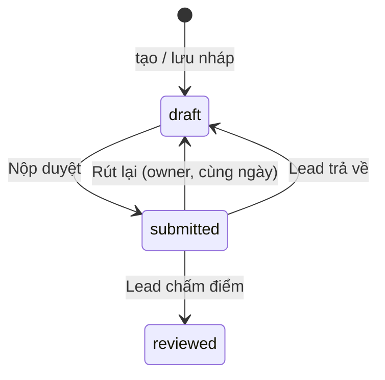

# Brief — Báo cáo hôm nay

> Trang soạn và nộp **báo cáo công việc hằng ngày** của chính người dùng.  
> URL: [`/daily-reports/today`](https://projects.vaschools.edu.vn/daily-reports/today) · Route: `daily-reports.today`  
> Spec kỹ thuật đầy đủ: [`DAILY_REPORT.md`](./DAILY_REPORT.md)

**Trạng thái:** Production  
**Đối tượng:** admin, lead, member (cần gắn hồ sơ nhân sự / `employee_id`). Viewer không vào được.

---

## 1. Một câu

Mỗi nhân viên soạn **một báo cáo / ngày** theo khung HORENSO, gắn việc đang làm, lưu nháp rồi nộp để quản lý duyệt và chấm điểm.

---

## 2. Mục đích

- Chuẩn hóa cách báo cáo công việc trong ngày (mục tiêu, tiến độ, vướng mắc, đề xuất, kế hoạch ngày mai).
- Gắn báo cáo với dự án / task thực tế trên workspace.
- Đưa báo cáo vào vòng duyệt: nháp → nộp → lead/admin chấm hoặc trả về.

Quy tắc nghiệp vụ: **một báo cáo / nhân viên / ngày**. Trang này luôn mở đúng bản của **ngày làm việc hôm nay** (múi giờ `Asia/Ho_Chi_Minh`). Chưa có thì tạo nháp mới; đã có thì sửa tiếp.

---

## 3. Người dùng làm gì trên trang

| Bước | Chức năng |
|------|-----------|
| 1. Thông tin | Tiêu đề (mặc định «Báo cáo ngày dd/mm/yyyy») + chọn dự án / task đang được giao, chưa hoàn thành. Có thể gắn task phát sinh từ báo cáo. |
| 2. Nội dung HORENSO | Soạn 5 trường rich text (xem §4). Thanh tiến độ + tab báo mục còn thiếu. |
| 3. Mẫu sẵn | Áp dụng khung HORENSO để điền nhanh. |
| 4. Lưu nháp | Giữ trạng thái `draft`. Sau lần lưu đầu, trang tự động lưu. |
| 5. Nộp duyệt | Chuyển `draft` → `submitted`. Lead/admin chấm tại `/daily-reports/review`. |
| 6. Rút lại | Nếu đã nộp **trong ngày**, owner có thể rút về nháp, sửa rồi nộp lại. |

Khi đã nộp hoặc đã duyệt, form khóa nội dung (trừ khi rút lại thành công). Màn hình xác nhận dẫn sang chi tiết báo cáo.

---

## 4. Nội dung báo cáo (HORENSO)

| Trụ | Trường | Bắt buộc khi nộp |
|-----|--------|------------------|
| Báo cáo (報告) | Mục tiêu hôm nay | Có |
| Báo cáo (報告) | Tiến độ thực hiện | Có |
| Liên lạc (連絡) | Khó khăn & vướng mắc | Không |
| Trao đổi (相談) | Đề xuất cải tiến | Không |
| Kế hoạch (計画) | Kế hoạch ngày mai | Có |

Tiêu đề cũng bắt buộc khi nộp.

---

## 5. Luồng trạng thái (từ trang này)



| Trạng thái | Nhãn UI | Trên trang Today |
|------------|---------|------------------|
| `draft` | Nháp | Soạn, lưu, nộp |
| `submitted` | Chờ duyệt | Khóa form; có thể rút lại trong ngày |
| `reviewed` | Đã duyệt | Khóa form; xem lại chi tiết |

**Nộp:** chỉ owner; không nộp ngày nghỉ (mặc định T2–T7); nộp sau **18:00** bị đánh dấu trễ.

**Rút lại:** chỉ owner, báo cáo đang `submitted`, và vẫn trong ngày làm việc hôm nay.

---

## 6. Trong module Báo cáo ngày

```
Sidebar nhóm Báo cáo
 ├── Báo cáo hôm nay     /daily-reports/today     ← trang này (soạn / nộp)
 ├── Lịch sử báo cáo     /daily-reports           (xem KPI, lọc, xuất)
 └── Chờ phê duyệt       /daily-reports/review    (lead/admin chấm)
```

Chi tiết một báo cáo: `/daily-reports/{id}`.  
Trang Việc của tôi (`/my-work`) có hàng trạng thái + link sang `/daily-reports/today`.

---

## 7. Ngoài phạm vi trang này

- Chấm điểm / trả về báo cáo người khác → `/daily-reports/review`
- Lọc lịch sử, KPI, xuất Excel → `/daily-reports`
- Nhập Excel bulk cho báo cáo — chưa có

---

## 8. File liên quan

| Lớp | Đường dẫn |
|-----|-----------|
| Page | `resources/js/Pages/DailyReport/Today.vue` |
| Config HORENSO | `resources/js/modules/daily-report/config/reportConfig.js` |
| Controller | `DailyReportController@today` |
| Use Cases | Create / Update / Submit / Recall |
| Policy | `DailyReportPolicy` (`create`, `update`, `submit`, `recall`) |
