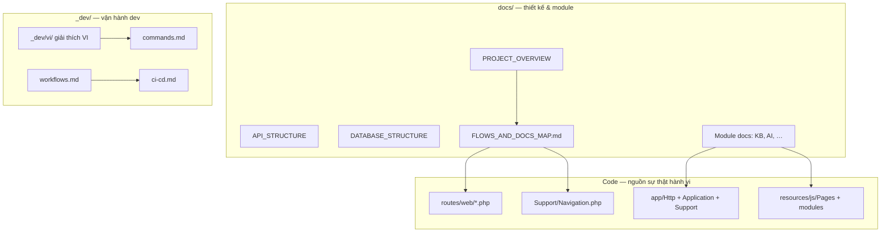
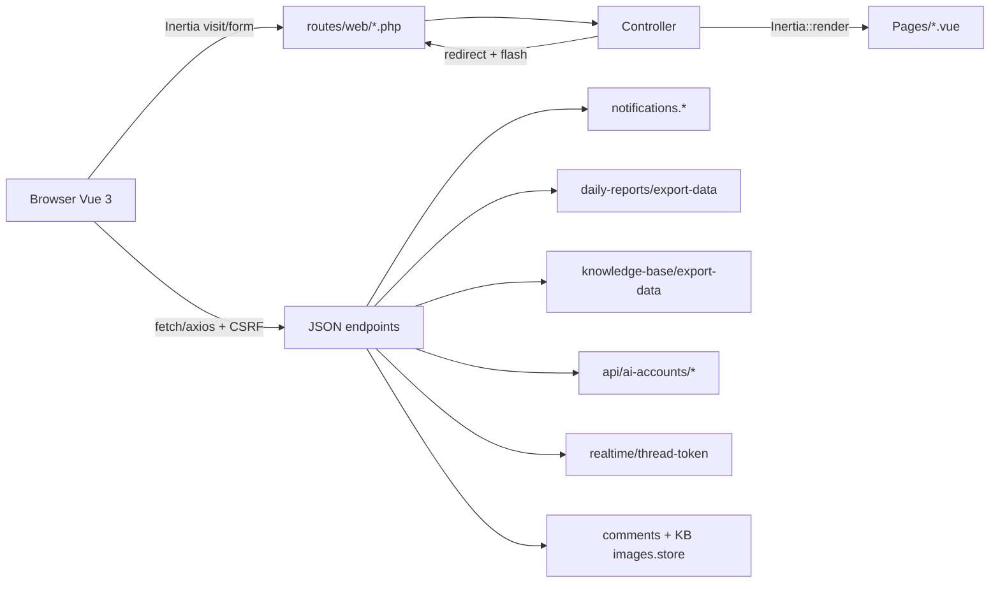
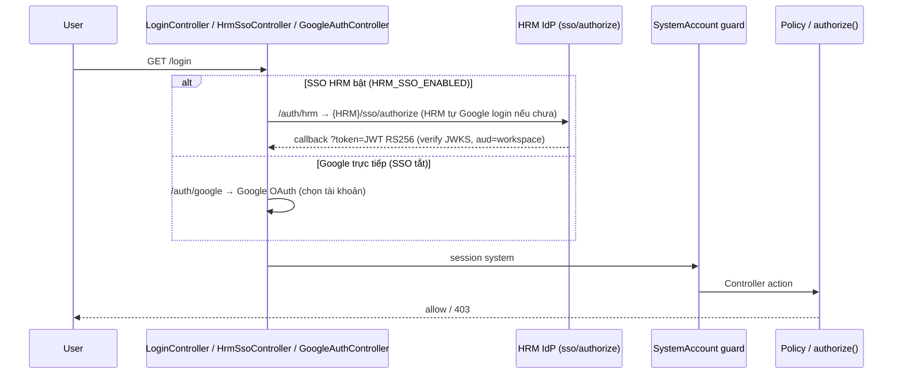
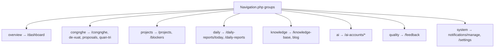
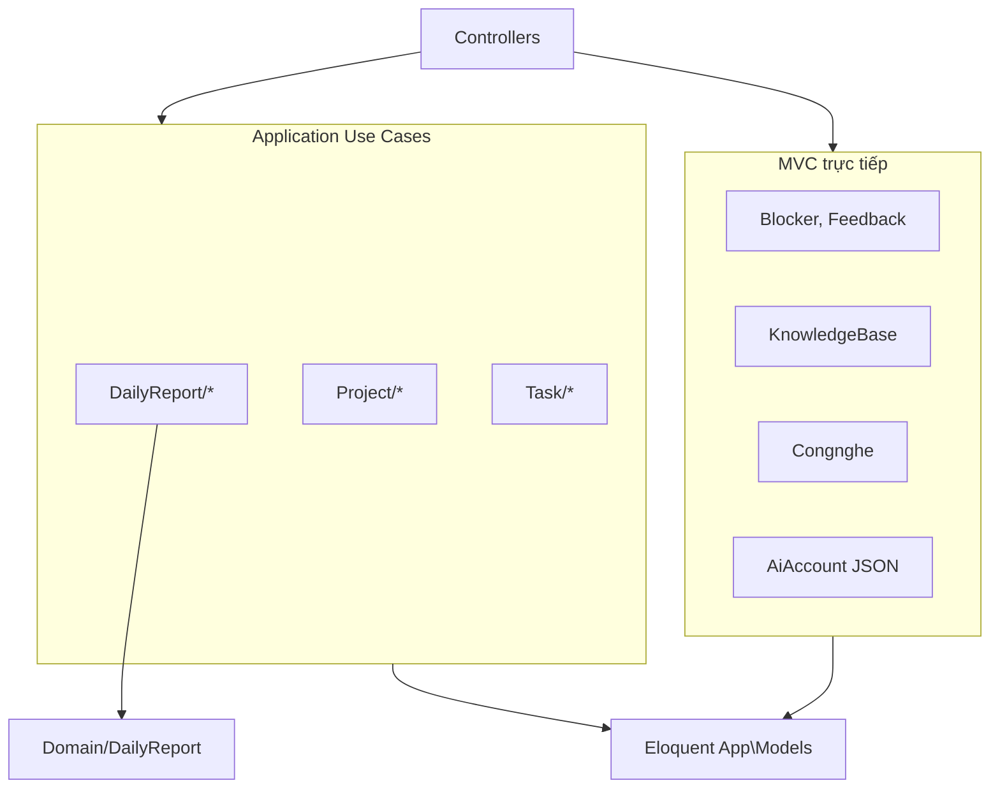
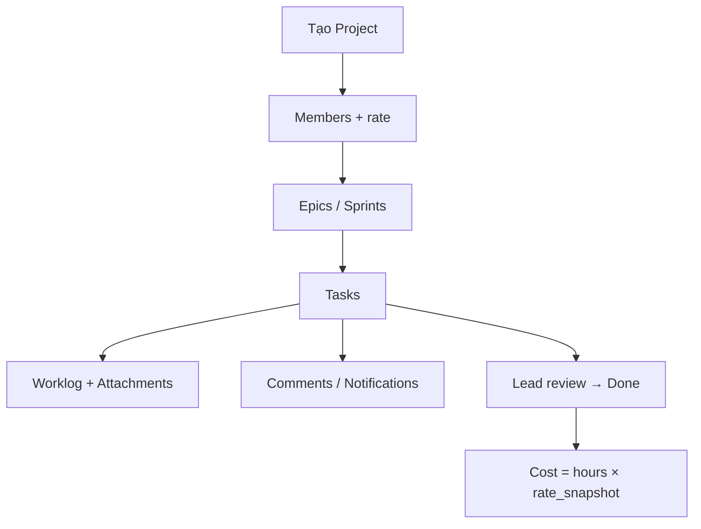
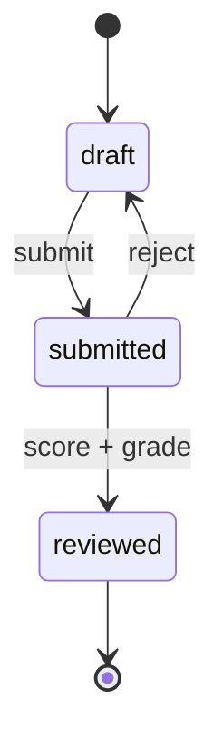
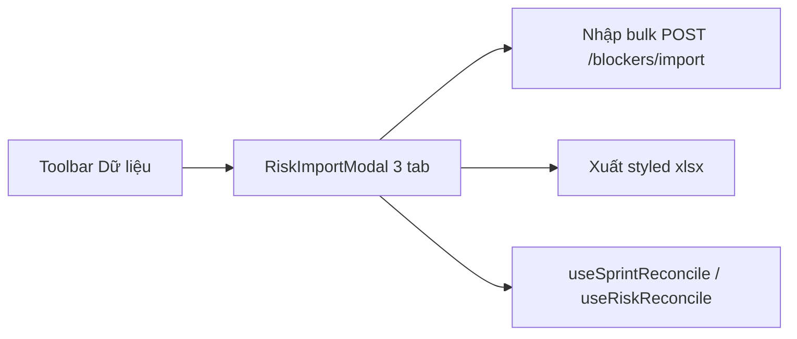
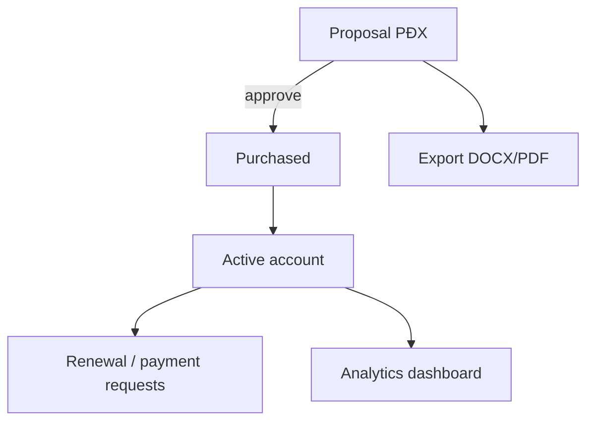

# Sơ đồ luồng & bản đồ tài liệu — VA Workspace

> **Mục đích:** Đối chiếu **code ↔ `docs/` ↔ `_dev/`** — một điểm vào cho onboarding, PR doc-sync, và sơ đồ luồng (mermaid).  
> **Cập nhật:** 2026-06-19 · Nguồn route: `routes/web/*.php` · Nav: `App\Support\Navigation`.

---

## 1. Ba lớp tài liệu



| Lớp | Vai trò | Khi sửa code |
|-----|---------|--------------|
| **`docs/`** | Kiến trúc, route map, schema, luồng nghiệp vụ, UI map | Cập nhật file module + `API_STRUCTURE` / `DATABASE_STRUCTURE` nếu đổi contract (`.cursor/rules/docs-sync.mdc`) |
| **`_dev/`** | Lệnh CLI, PR, CI, test, troubleshooting | Chỉ khi đổi script, hook, workflow CI — **không** thay module spec |
| **`.cursor/`** | Rule/skill rút gọn cho agent | Trỏ về `docs/`; không nhân bản spec dài |

**`_dev/vi/`** = giải thích tiếng Việt, luôn link file EN gốc (`_dev/README.md`).

---

## 2. Vận chuyển request (Inertia vs JSON)



| Pattern | Ví dụ | Doc |
|---------|--------|-----|
| Inertia page + mutation redirect | CRUD dự án, báo cáo ngày, KB show | `API_STRUCTURE.md` §2, `ARCHITECTURE.md` |
| JSON poll / SPA partial | Notifications inbox | `API_STRUCTURE.md` §2.3, TD-017 |
| JSON export client | Daily report 7 sheet, KB CSV/Excel, Sprint/Risk modal | `IMPORT_EXPORT_RECONCILE.md` |
| JSON CRUD workspace | AI Accounts (`api.ai-accounts.*`) | `AI_ACCOUNTS.md` |
| Stream file | Attachments KB, project | Module doc + `PublicMediaUrl` |

`routes/api.php` **rỗng** — REST v1 là đề xuất tương lai (`API_STRUCTURE.md` §7).

---

## 3. Xác thực & phân quyền



| Role | Mô tả | Doc |
|------|--------|-----|
| `admin` | Toàn quyền + settings + congnghe quản trị | `PROJECT_OVERVIEW.md` §5 |
| `lead` | Dự án, review báo cáo, quản lý đề xuất CN | Policies trong `AuthServiceProvider` |
| `member` | Làm việc, báo cáo ngày, KB authoring | — |
| `viewer` | Đọc (dashboard, dự án, KB published) | — |

Login UI: `.cursor/skills/login/SKILL.md` · Password login: `config/va.php` (E2E/PHPUnit only).
SSO HRM: env `HRM_SSO_*` — HRM là IdP nội bộ (user Google login một lần trên HRM); Workspace chỉ tin JWT từ `/sso/authorize` (contract: `va-hrm/docs/integrations/workspace.md`). JWT SSO user ≠ token M2M `HRM_API_TOKEN`.

---

## 4. Sidebar → route (Navigation groups)



Chi tiết từng nhóm route: `API_STRUCTURE.md` §3 · Module: bảng §6 bên dưới.

---

## 5. Pattern backend theo module



| Module | Pattern | Doc kiến trúc |
|--------|---------|----------------|
| Daily Report | Clean + Use Cases | `ARCHITECTURE.md`, `daily-report-domain` skill |
| Project / Task | Use Cases (mutations) | `ARCHITECTURE.md`, `FOLDER_STRUCTURE.md` |
| Blocker / Feedback | MVC + import bulk | `IMPORT_EXPORT_RECONCILE.md` |
| Knowledge Base | MVC | `KNOWLEDGE_BASE.md` §2.1 |
| Công Nghệ | MVC + ContentRepository | `CONGNGHE_CONTENT.md` |
| AI Accounts | Inertia pages + JSON API | `AI_ACCOUNTS.md` |
| System settings | MVC + SettingsRepository | `SYSTEM_CONFIG.md` |

---

## 6. Bản đồ module → doc → code chính

| Domain (nav) | Doc module | Controller / entry | Frontend |
|--------------|------------|--------------------|----------|
| Tổng quan | `PROJECT_OVERVIEW.md` §3 | `HubDashboardController` | `Pages/Dashboard/` |
| Trung tâm Công Nghệ | `CONGNGHE_CONTENT.md` | `Congnghe/*` | `Pages/Congnghe/`, `CongngheAdmin/` |
| Dự án & vướng mắc | **`PROJECT_MANAGEMENT.md`** (+ `API_STRUCTURE` §2.4–2.11) | `Project/*`, `BlockerController` | `Pages/Project/`, `modules/project/` |
| Báo cáo ngày | `DAILY_REPORT.md` (+ `DAILY_REPORT_PROJECTS.md` liên kết dự án) | `DailyReport/*` | `Pages/DailyReport/`, `modules/daily-report/` |
| Hồ sơ | `API_STRUCTURE` §2.18 | `ProfileController` | `Pages/Profile/` |
| Tri thức | `KNOWLEDGE_BASE.md` | `KbArticleController` | `Pages/KnowledgeBase/` |
| AI Workspace | `AI_ACCOUNTS.md` | `AiAccount/*`, `api/ai-accounts` | `Pages/AiAccount/`, `modules/aiAccount/` |
| Phản hồi | `API_STRUCTURE` §2.12 | `FeedbackController` | `Pages/Feedback/` |
| Hệ thống | `SYSTEM_CONFIG.md` | `SystemSettingController`, `Notification*` | `Pages/Settings/`, `Notifications/` |
| Nhập/xuất Excel | `IMPORT_EXPORT_RECONCILE.md` | `Blocker@import`, … | `*DataModal`, `use*Import.js` |

**Chéo:** Comments morph — `CommentController` + `CommentThread.vue` (Task, Blocker, Feedback, KB, …). Realtime token: `_dev/realtime.md`, route `realtime.thread-token`.

---

## 7. Luồng nghiệp vụ (tóm tắt + link sơ đồ sâu)

### 7.1 Quản lý dự án



Workspace UI: tab trong `Project/Show` (Sprint, Gantt, Dashboard, …) — **`PROJECT_MANAGEMENT.md` §6** · `FRONTEND_STRUCTURE.md`.

### 7.2 Báo cáo ngày



Use cases: `app/Application/DailyReport/`. Chi tiết: [`DAILY_REPORT.md`](./DAILY_REPORT.md).

### 7.3 Vướng mắc / nhập Excel



Chi tiết: `IMPORT_EXPORT_RECONCILE.md`.

### 7.4 Đề xuất phần mềm (Công Nghệ)

```mermaid
flowchart LR
  U[Member: /congnghe/de-xuat] --> S[store + email]
  S --> M[Lead/Admin: /congnghe/proposals]
  M --> ST[Cập nhật trạng thái]
  U2[/de-xuat-cua-toi] --> U
```

Landing content: `config/congnghe.php` + override DB — `CONGNGHE_CONTENT.md`.

### 7.5 AI Accounts (PĐX → TK → chi phí)



`AI_ACCOUNTS.md` · JSON: `routes/web/ai-accounts.php` prefix `api.ai-accounts`.

### 7.6 Knowledge Base

Sơ đồ đầy đủ: **`KNOWLEDGE_BASE.md` §2.1** (Show sequence, blog hub, media, export).

---

## 8. `_dev/` — câu hỏi thường gặp

| Câu hỏi | Đọc EN | Đọc VI |
|---------|--------|--------|
| Chạy dev / test / build? | `_dev/commands.md` | `_dev/vi/lenh-cli.md` |
| Nhánh, PR, hotfix? | `_dev/workflows.md` | `_dev/vi/quy-trinh.md` |
| Commit, ESLint, import Excel? | `_dev/conventions.md` | `_dev/vi/quy-uoc.md` |
| CI đỏ? | `_dev/ci-cd.md` | `_dev/vi/ci-cd.md` |
| Playwright? | `_dev/testing.md` | `_dev/vi/kiem-thu.md` |
| Husky / npm lỗi? | `_dev/troubleshooting.md` | `_dev/vi/loi-thuong-gap.md` |
| Realtime comments? | `_dev/realtime.md` | `_dev/vi/realtime.md` |

Pre-push gates: `.cursor/skills/ship-ready/SKILL.md` · `.cursor/rules/ci-quality-gates.mdc`.

---

## 9. Checklist đối chiếu doc sau thay đổi code

1. **Route mới/đổi** → `API_STRUCTURE.md` §2 + §3 grouping.
2. **Migration / cột** → `DATABASE_STRUCTURE.md`.
3. **Page / component** → `FRONTEND_STRUCTURE.md` + doc module.
4. **Luồng UX mới** → thêm mermaid vào doc module hoặc §7 file này.
5. **npm script / CI job** → `_dev/commands.md` + `_dev/ci-cd.md` (+ `vi/` nếu cần).
6. **Không** để `PROJECT_OVERVIEW` ghi module «kế hoạch» khi đã có route trong `routes/web/*.php`.

---

## 10. Index file `docs/`

| File | Nội dung |
|------|----------|
| `PROJECT_OVERVIEW.md` | Mục tiêu, module, stack, trạng thái |
| `ARCHITECTURE.md` | Layer, coupling, target |
| `FOLDER_STRUCTURE.md` | Cây thư mục sau refactor |
| `FRONTEND_STRUCTURE.md` | Pages, modules/, shared/, composables |
| `API_STRUCTURE.md` | Toàn bộ web routes |
| `DATABASE_STRUCTURE.md` | Bảng `va_prd_*` |
| `FLOWS_AND_DOCS_MAP.md` | **File này** |
| `IMPORT_EXPORT_RECONCILE.md` | Excel 3 tab |
| `KNOWLEDGE_BASE.md` | Wiki nội bộ |
| `AI_ACCOUNTS.md` | Quản lý AI |
| `CONGNGHE_CONTENT.md` | Landing + quản trị /congnghe |
| `SYSTEM_CONFIG.md` | `/settings` |
| `PROJECT_MANAGEMENT.md` | Quản lý dự án `/projects` (danh mục, workspace, sprint, task, tài liệu) |
| `DAILY_REPORT_PROJECTS.md` | Báo cáo ngày & liên kết dự án |
| `CONTRACT_MANAGEMENT.md` | Quản lý hợp đồng / NCC (CLM) |
| `CREDENTIAL_MANAGEMENT.md` | Kho tài khoản / mật khẩu |
| `PERFORMANCE_ANALYTICS.md` | Hiệu suất & audit công việc |
| `ONBOARDING.md` | Tour tương tác khi đăng nhập |
| `REFACTOR_PLAN.md` / `TECHNICAL_DEBT.md` | Nợ & roadmap |
