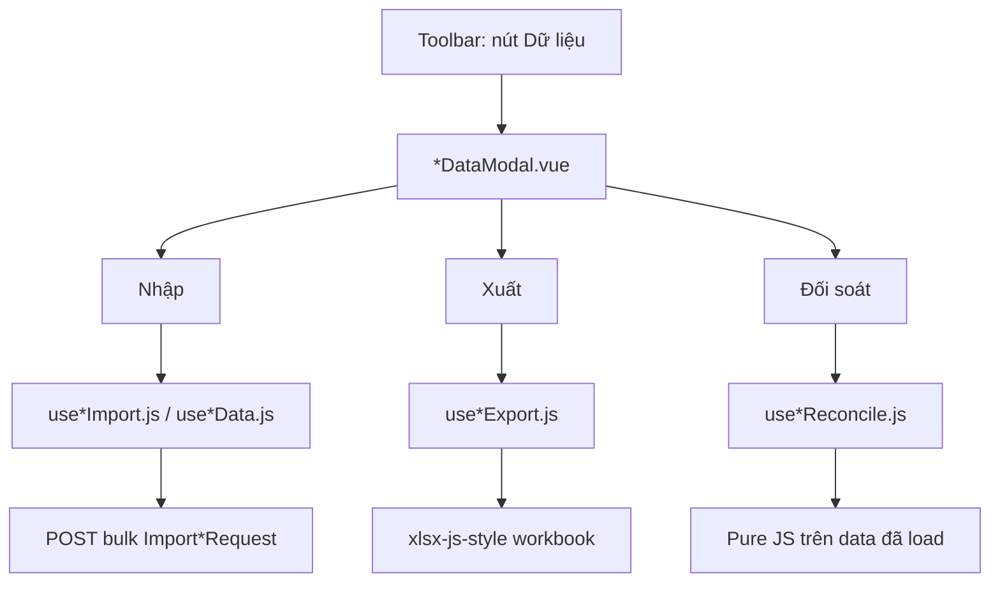
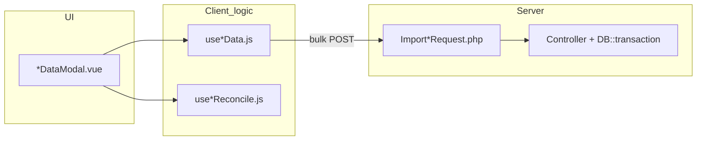
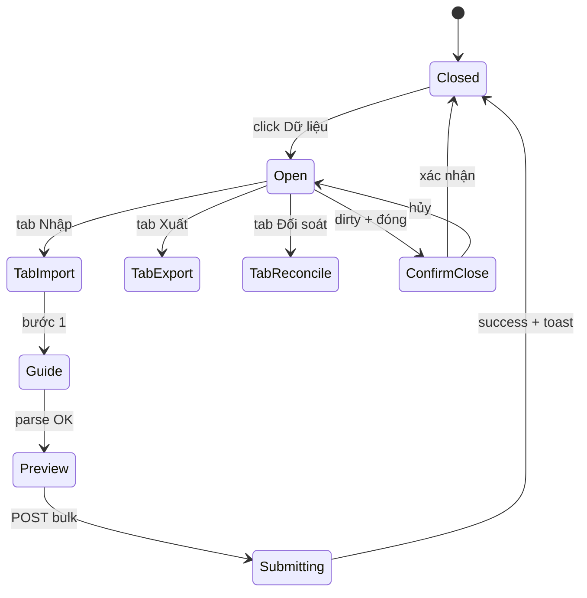
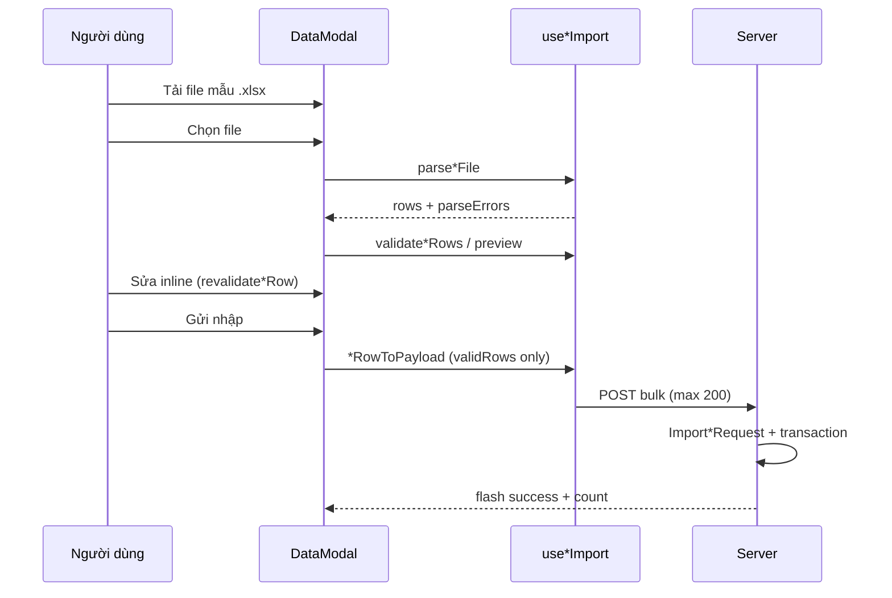
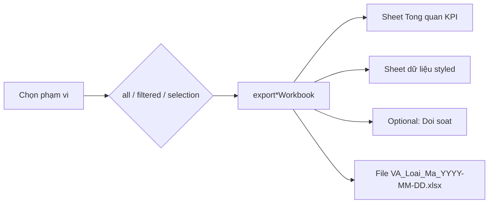
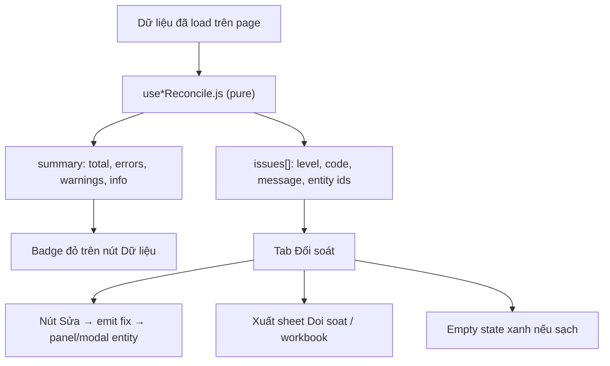

# Nhập · Xuất · Đối soát — Production Standard

> Chuẩn Excel hàng loạt trong VA-Workspace. Rule Cursor (tóm tắt + glob): `.cursor/rules/import-export-reconcile.mdc`.  
> **Cập nhật:** 2026-06-16 — nguồn đầy đủ cho onboarding và PR checklist.

---

## 1. Tổng quan một điểm vào

Mọi module nhập/xuất/đối soát dùng **một nút toolbar** (vd. **Dữ liệu**) → **một modal** → **ba tab cố định**. Không tách ba modal riêng.



### Tham chiếu vàng (code)

| Domain | Composable | Modal | Backend import |
|--------|------------|-------|----------------|
| Test case (Blocker) | `useRiskImport.js`, `useRiskExport.js` | `RiskImportModal.vue` | `BlockerController@import` + `ImportBlockerRequest` |
| Nhà cung cấp (CLM) | `useVendorData.js` (`useVendorExport.js` re-export xuất nhanh) | `VendorDataModal.vue` | `VendorController@import` + `ImportVendorRequest` |
| Sprint / Task | `useSprintData.js` (`useSprintExport.js` re-export) | `SprintDataModal.vue` | `TaskController@import` + `ImportTaskRequest` (bulk, max 200) |
| Đối soát sprint | `useSprintReconcile.js` | tab trong `SprintDataModal` | Client-side only |

Knowledge Base **không** dùng pattern 3 tab — chỉ xuất danh sách qua `GET knowledge-base.export-data` + `useKbExport.js` (JSON → CSV/Excel client).

---

## 2. Kiến trúc tách lớp



| Lớp | Trách nhiệm | Cấm |
|-----|-------------|-----|
| `use*Data.js` / `use*Import.js` | Excel I/O, parse, validate, template, export styled | Import `xlsx` trong `.vue` |
| `*DataModal.vue` | Tab UI, state, composable, Inertia/router | Business rules trùng composable |
| `use*Reconcile.js` | Pure checks → `{ issues, summary }` | Gọi API |
| `Import*Request.php` | Validate rows server-side (mirror client) | Tin client 100% |
| Controller | `DB::transaction`, policy, activity log | N+1 POST từng dòng từ browser |

**API composable export tối thiểu:**  
`download*Template`, `parse*File`, `validate*Rows`, `createPreviewRows`, `revalidate*Row`, `*RowToPayload`, `export*Workbook` (+ `exportPreviewRows` nếu sửa offline).

---

## 3. Luồng UI modal



Quy tắc UX:

- Tab: `import` | `export` | `reconcile` — prop `initialTab` khi mở từ badge lỗi đối soát.
- `dirty` + `useConfirmClose` khi có preview; reset state khi `close`.
- `canManage` / `canContribute`: ẩn nhập, disable submit; export thường mở cho viewer.
- Badge đỏ trên nút khi `summary.errors > 0`.
- Loading `parsing` / `importing`; toast tiếng Việt; Inertia `preserveScroll: true`.

---

## 4. Luồng nhập (2 bước + submit)



1. **Guide:** quy trình, **Tải file mẫu**, **Chọn file** (`.xlsx|.xls|.csv`), hiển thị `parseErrors`.
2. **Preview:** tab Hợp lệ / Lỗi; sửa inline; xuất dòng lỗi (optional, như risk).
3. **Submit:** chỉ `validRows` → **một** `router.post`.

**Không production:** loop `router.post` từng record (Sprint — migrate sang bulk).

---

## 5. File mẫu Excel

Thư viện: **`xlsx-js-style`** (không `xlsx` trần cho template/export chính).

**Brand:** `BRAND=9A0036`, `BRAND_SOFT=FDF2F6`, `SLATE_50`, `SLATE_200`, styles `S.title|subtitle|header|required|sample|guide|note|cell|cellAlt`.

| Sheet | Nội dung |
|-------|----------|
| **Huong dan** | 9 mục: cấu trúc file, quy trình 10 bước, bảng cột, enum, FK tham chiếu, lỗi thường gặp |
| **Nhap lieu** | Marker `VA_<MODULE>_IMPORT_V1`, header dòng 5, 2 sample italic (6–7), nhập từ dòng 8, ≥50 ô trống |
| **Tham chiếu** | (nếu FK) vd. Danh sách Sprint — chỉ đọc, không upload |

**Parse:** `readSheetMatrix` + `findHeaderIndex`; `columnIndexMap` normalize tiếng Việt; alias enum; `parseExcelDate`; bỏ dòng mẫu/trống; trả `{ rows, errors }`. **Max 200 rows** client + server.

---

## 6. Backend import

```php
// Import*Request: authorize, rows max:200, rows.* mirror DB/enums
// Controller: DB::transaction, ActivityLogger, flash với count
```

- Validate enum, FK (`exists:employees,id`), `max:` string.
- Messages tiếng Việt trong `messages()`.
- Không commit một phần khi lỗi giữa chừng.

---

## 7. Luồng xuất



- Styled: `setCell`, `mergeRow`, `setColWidths`, header brand, zebra.
- CSV chỉ khi yêu cầu rõ; Excel mặc định.

---

## 8. Luồng đối soát



Cấu trúc issue:

```js
issues: [{ level: 'error'|'warning'|'info', code, message, taskId?, sprintId? }]
summary: { total, errors, warnings, info }
```

- `code` ổn định (`no_assignee`, `sprint_overlap`, …) để filter/test.

---

## 9. Bảo mật & quyền

- Template/export không secret; dữ liệu theo quyền user trên page.
- Import: `authorize` create/update; scope `project_id` (hoặc tương đương).
- Extension whitelist; file ≤5MB khuyến nghị.

---

## 10. Anti-patterns

- Ba nút / ba modal riêng Nhập · Xuất · Đối soát.
- Import không file mẫu hoặc thiếu sheet Huong dan.
- Parse không marker/header.
- Export không style cho báo cáo user-facing.
- Chỉ validate client.
- Hardcode enum thay vì `Options` / `Enum::values()`.

---

## 11. Definition of Done (PR)

- [ ] Một `*DataModal` + composable; không logic Excel trong Vue
- [ ] Template + sheet Huong dan production
- [ ] Parse + validate + preview hợp lệ/lỗi
- [ ] Bulk import API + FormRequest + transaction (hoặc ticket follow-up)
- [ ] Export styled + phạm vi
- [ ] Reconcile composable + tab + export báo cáo
- [ ] `canManage` respected; toast tiếng Việt
- [ ] Copy pattern Risk nếu module mới — cập nhật bảng §1 trong doc này

---

## 12. Liên kết docs khác

| File | Liên quan |
|------|-----------|
| `docs/FRONTEND_STRUCTURE.md` § Import / Export / Đối soát | Pages + composables |
| `.cursor/rules/datagrid-toolbar.mdc` | Một nút Dữ liệu trên toolbar |
| `_dev/conventions.md` | Checklist dev |
| `docs/KNOWLEDGE_BASE.md` § Xuất | `useKbExport` (JSON, không 3 tab) |
