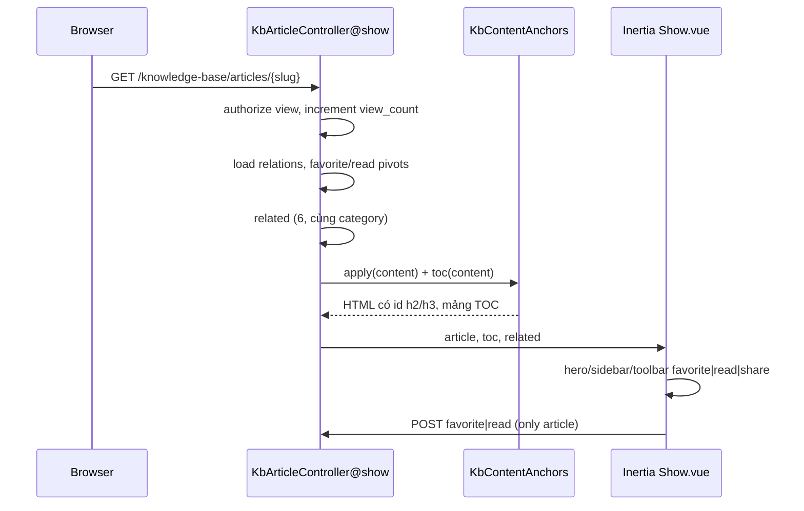
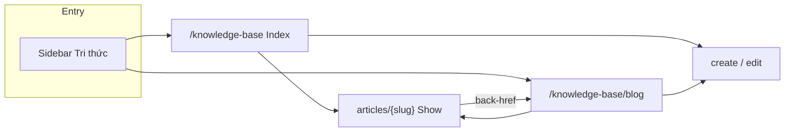
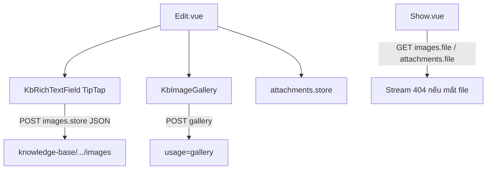
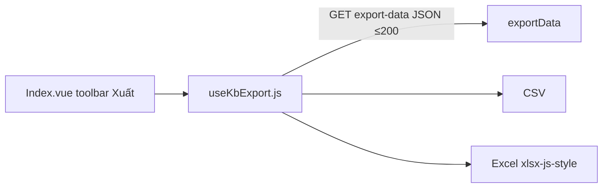

# KNOWLEDGE BASE — Module Tri Thức

> Wiki nội bộ kiểu Viblo / Notion Wiki / Confluence (phiên bản đơn giản), tích hợp trong VA-Workspace (Laravel 10 + Inertia + Vue 3).
> **Trạng thái:** ✅ Triển khai v1 (2026-06-14) — migrations, CRUD bài viết, tìm kiếm, file. Chi tiết route: `routes/web/knowledge-base.php` prefix `knowledge-base.`.

---

## 1. Mục tiêu & phạm vi

| Mục tiêu | Mô tả |
|---|---|
| Lưu trữ tri thức tổ chức | Quy trình, HOWTO, onboarding, kinh nghiệm thực tế, tài liệu nội bộ |
| Khám phá nội dung | Sidebar danh mục, danh sách bài, tìm kiếm, lọc tag/danh mục |
| Đọc & tương tác | TOC tự động, bài liên quan, yêu thích, đánh dấu đã đọc, lượt xem |
| Cộng tác nội bộ | Bình luận (tái sử dụng polymorphic `Comment`) |
| Xuất bản có kiểm soát | Draft → Published → Archived, phân quyền xem theo vai trò |

**Ngoài phạm vi v1 (có thể follow-up):** versioning đầy đủ như Confluence, public blog, đa ngôn ngữ, Scout/Elasticsearch (có thể bật sau).

---

## 2. Kiến trúc

Pattern **MVC** giống Blocker / Feedback — không tách Clean Architecture trừ khi sau này cần workflow phức tạp.

```
routes/web/knowledge-base.php (prefix knowledge-base., name knowledge-base.*)
    → KbArticleController
        index, create, store, show, edit, update, destroy
        toggleFavorite, markRead, exportData (JSON)
        storeAttachment, storeImage, storeGalleryImage
        updateGalleryImage, destroyGalleryImage
        attachmentFile, imageFile
    → StoreKbArticleRequest, UpdateKbArticleRequest
    → KbArticlePolicy
    → KbArticleResource, KbCategoryResource
    → Models: KbArticle, KbCategory, KbTag, KbArticleImage, KbArticleAttachment, …
    → app/Support/KnowledgeBase/
        KbArticleSearch, KbContentAnchors, KbTagSync, KbBlogSidebarData

resources/js/
    → Pages/KnowledgeBase/Index.vue   (PageHeader + datagrid, lọc danh mục, xuất CSV/Excel)
    → Pages/KnowledgeBase/Blog.vue    (layout blog: sidebar + feed ảnh bìa; feed **chỉ Published**; lọc Inertia `only: articles,filters`)
    → Pages/KnowledgeBase/Show.vue    (chi tiết đọc bài: breadcrumb, hướng dẫn + tooltip, floating toolbar, cùng chuyên mục, bình luận; full width)
    → modules/knowledge-base/components/KbArticleHero.vue, KbArticleCover.vue, KbArticleToc.vue, KbReadingProgress.vue, KbRelatedArticles.vue, KbFloatingToolbar.vue
    → modules/knowledge-base/components/KbArticleCard.vue, KbBlogPanel.vue, KbBlogTagSection.vue, KbBlogSidebar.vue, KbBlogAside.vue, KbBlogPostCard.vue
    → Pages/KnowledgeBase/Edit.vue    (TipTap + gallery)
    → modules/knowledge-base/components/KbRichTextField.vue, KbImageGallery.vue, KbTagField.vue
    → composables/useKbExport.js
    → shared/ui: DatagridToolbarSearch, FilterVisibilityDropdown, CommentThread
```

**Route model binding:** `{article}` resolve theo **`slug`** (`KbArticle::getRouteKeyName()`).

**Lưu file:** disk `public`, path `knowledge-base/{article_id}/images|attachments` — URL qua route tải `knowledge-base.images.file` / `attachments.file` (auth). Deploy: `storage/app/public` phải ghi được bởi PHP (xem `_dev/troubleshooting.md` — KB `UnableToCreateDirectory`).

**Rich text:** TipTap — ảnh inline qua `POST knowledge-base.articles.images.store` (nút 🖼, kéo thả, dán clipboard); trang tạo bài tự tạo bản nháp JSON khi chèn ảnh lần đầu (`POST articles` + `Accept: application/json`).

**Tìm kiếm v1:** `KbArticleSearch` — FULLTEXT / LIKE trên title, excerpt, content (MySQL migration `2026_06_14_130000_kb_articles_fulltext_and_image_usage.php`).

### 2.1 Sơ đồ luồng (đối soát code ↔ doc)

#### Luồng đọc bài (`Show`)



#### Luồng hub nội dung



#### Luồng media & soạn thảo



#### Xuất danh sách



Chuẩn modal 3 tab Nhập/Xuất/Đối soát Excel: [`docs/IMPORT_EXPORT_RECONCILE.md`](IMPORT_EXPORT_RECONCILE.md) (KB chỉ xuất JSON client).

---

## 3. Phân quyền

Ánh xạ trên guard `system` và role hiện có (`admin` | `lead` | `member` | `viewer`). Knowledge Base **không** dùng Super Admin / Coach / Student riêng.

| Hành động | admin | lead | member | viewer |
|---|---|---|---|---|
| Xem bài `published` | ✅ | ✅ | ✅ | ✅ (có thể giới hạn danh mục — xem §3.1) |
| Xem bài `draft` / `archived` | ✅ | ✅ (tác giả hoặc toàn bộ — cấu hình) | Tác giả + lead | ❌ |
| Tạo / sửa bài | ✅ | ✅ | ✅ (draft của mình; publish theo policy) | ❌ |
| Xóa / archive | ✅ | ✅ | Chỉ draft của mình (tùy policy) | ❌ |
| Yêu thích / đánh dấu đã đọc | ✅ | ✅ | ✅ | ✅ |
| Bình luận | ✅ | ✅ | ✅ | ✅ (nếu được xem bài) |
| Quản lý danh mục / tag | ✅ | lead (tùy cấu hình) | ❌ | ❌ |

**Policy gợi ý:** `KbArticlePolicy` — `view`, `create`, `update`, `delete`, `publish`.

### 3.1 Phân quyền người xem (nâng cao)

- Cột `visibility` trên bài (đề xuất v2): `internal_all` | `restricted_roles` | `restricted_departments`.
- Hoặc ma trận trong `system_settings` (`permissions.kb_*`) đồng bộ `docs/SYSTEM_CONFIG.md`.
- v1: mọi `published` visible cho `member`+; `viewer` chỉ đọc; danh mục «Tài liệu nội bộ» có thể `lead+` only qua policy theo `category.slug`.

---

## 4. Chuyên mục kiến thức (danh mục)

Danh mục **seed cố định** (enum slug + bản ghi `kb_categories`), có thể mở rộng cây con qua `parent_id`:

| Slug | Tên hiển thị |
|---|---|
| `general` | Kiến thức chung |
| `development` | Kiến thức Development |
| `business-analyst` | Kiến thức Business Analyst (BA) |
| `ai-automation` | AI & Automation |
| `project-management` | Quản lý dự án |
| `field-experience` | Kinh nghiệm thực tế |
| `internal-docs` | Tài liệu nội bộ |
| `other` | Khác |

---

## 5. Quản lý bài viết

### 5.1 Trường dữ liệu

| Trường | Bắt buộc | Ghi chú |
|---|---|---|
| Tiêu đề | ✅ | max 500 |
| Slug SEO | ✅ | unique, auto từ title, cho phép sửa |
| Mô tả ngắn (`excerpt`) | Khuyến nghị | meta / card list |
| Nội dung | ✅ khi publish | HTML TipTap |
| Hình ảnh (gallery) | ❌ | nhiều file, metadata alt |
| Ảnh trong nội dung | ❌ | upload → URL trong HTML |
| File đính kèm | ❌ | PDF, DOCX, … |
| Tags | ❌ | many-to-many, autocomplete |
| Danh mục | ✅ | FK `category_id` |
| Người tạo | auto | `author_id` → employees |
| Ngày tạo / cập nhật | auto | timestamps |
| Trạng thái | ✅ | `draft` \| `published` \| `archived` |

### 5.2 Luồng trạng thái

```
draft ──publish──→ published ──archive──→ archived
  ↑                    │
  └──── unpublish ─────┘ (về draft, clear published_at tùy rule)
```

- `published_at` set khi lần đầu publish.
- `view_count` tăng khi `Show` (debounce theo session/account tùy chọn).

### 5.3 Seed tài liệu repo (`KnowledgeBaseSeeder`)

`database/seeders/KnowledgeBaseSeeder.php` quét **toàn bộ** `docs/**/*.md` và `_dev/**/*.md`, chuyển Markdown → HTML (`App\Support\KnowledgeBase\KbMarkdownHtml`), `updateOrCreate` theo slug `kb-{đường-dẫn}`.

| Trường | Giá trị seed |
|--------|----------------|
| Tác giả | **Nguyễn Anh Khoa** — `khoana@hcm.vaschools.edu.vn` (`Employee` `EMP-KHOANA`, tạo nếu chưa có) |
| Trạng thái | `published` |
| Danh mục | Theo prefix file (vd. `docs/AI_*` → `ai-automation`, `_dev/` → `internal-docs`) |
| Tag | `VA-Workspace`, `Tài liệu kỹ thuật`, … (+ `Tiếng Việt` cho `_dev/vi/`) |

Chạy: `php artisan db:seed --class=KnowledgeBaseSeeder` (sau migration KB). Nội dung bài có dòng *Nguồn repository: …* trỏ file gốc.

---

## 6. Chức năng nâng cao

| Tính năng | Cách triển khai |
|---|---|
| Full-text search | MySQL FULLTEXT (`KbArticleSearch`) + LIKE fallback; Scout tùy chọn phase 2 |
| Lọc tag / danh mục | Query params + datagrid toolbar (label **Tìm kiếm**, filter dòng 2) |
| Gallery ảnh | `kb_article_images.usage=gallery`, alt, CRUD trên Edit, grid trên Show |
| Xuất danh sách | `GET export-data` + `useKbExport.js` (CSV/Excel, tối đa 200) |
| Bài liên quan | Cùng category, limit **6**, exclude current — carousel `KbArticleCardsSwiper` |
| Các bài khác | `otherArticles` limit **100** — `KbMoreArticles` + Swiper (không lưới) |
| Breadcrumb | Home → Tri thức → {Category} → {Title} |
| Yêu thích | Pivot `kb_article_favorites` |
| Đã đọc | Pivot `kb_article_reads` + `read_at` |
| Lượt xem | `view_count` trên article |
| Bình luận | `Comment` morph `KbArticle` |
| TOC | Server: `KbContentAnchors::toc`; client: `KbArticleToc` (sidebar desktop + plain mobile) |

---

## 7. Giao diện

Tham chiếu UX: Viblo (list + tag), Notion Wiki (sidebar cây), Confluence (breadcrumb + TOC).

### 7.1 Layout

```
┌─────────────────────────────────────────────────────────────┐
│ KbReadingProgress (sticky top)                               │
│ AppLayout #header — PageHeader (title rút gọn, back → /blog) │
├─────────────────────────────────────────────────────────────┤
│ Index: KbSummaryBar + datagrid (Tìm kiếm, Lọc/Cột/Xuất)      │
│ Blog:  KbBlogSidebar + feed KbBlogPostCard (Published only)  │
│ Show:  KbFloatingToolbar (lg+, fixed phải)                   │
│        full width: card nội dung                               │
│        → KbRelatedArticles (Swiper) → KbArticleCommentsSection → KbMoreArticles (Swiper) │
└─────────────────────────────────────────────────────────────┘
```

- **Show — thứ tự trong card:** Hero → excerpt → cover → TOC mobile → prose → gallery → attachments.
- **Responsive:** Floating toolbar `lg+`; TOC dạng `plain` trên mobile (không sidebar desktop).
- **Brand:** `#9A0036`, copy tiếng Việt; tooltip: `FieldTooltip` / `shared/ui/HoverTooltip.vue` trên hero & gallery.

### 7.2 Trang chính

| Page | Route name | URI |
|---|---|---|
| `KnowledgeBase/Index.vue` | `knowledge-base.index` | `GET /knowledge-base` |
| `KnowledgeBase/Blog.vue` | `knowledge-base.blog` | `GET /knowledge-base/blog` |
| `KnowledgeBase/Show.vue` | `knowledge-base.articles.show` | `GET /knowledge-base/articles/{article:slug}` |
| `KnowledgeBase/Edit.vue` | `knowledge-base.articles.create` / `.edit` | `GET …/create`, `GET …/{article}/edit` |

Danh mục (toolbar Lọc) và datagrid nằm trong **Index.vue** (không tách `modules/knowledge-base/`). Prop Inertia `summary` phục vụ `KbSummaryBar.vue`.

---

## 8. Database schema

Prefix bảng: `va_prd_`. Chi tiết cột: `docs/DATABASE_STRUCTURE.md` §7.

| Bảng | Mô tả |
|---|---|
| `kb_categories` | Danh mục, sort, parent_id |
| `kb_articles` | Bài viết chính |
| `kb_tags` | Tag |
| `kb_article_tags` | Pivot |
| `kb_article_images` | Gallery / upload riêng |
| `kb_article_attachments` | File đính kèm |
| `kb_article_favorites` | Yêu thích theo `system_account_id` |
| `kb_article_reads` | Đã đọc |

**Comments:** `va_prd_comments` — `commentable_type = App\Models\KbArticle`.

---

## 9. Route map (thực tế — `routes/web/knowledge-base.php`)

| Method | URI | Name | Ghi chú |
|---|---|---|---|
| GET | `/knowledge-base` | `knowledge-base.index` | List + filters Inertia |
| GET | `/knowledge-base/blog` | `knowledge-base.blog` | Blog feed + `KbBlogSidebarData` |
| GET | `/knowledge-base/export-data` | `knowledge-base.export-data` | **JSON** — lọc giống index, ≤200 (export client) |
| GET | `/knowledge-base/articles/create` | `knowledge-base.articles.create` | |
| POST | `/knowledge-base/articles` | `knowledge-base.articles.store` | |
| GET | `/knowledge-base/articles/{article}` | `knowledge-base.articles.show` | `{article}` = **slug** |
| GET | `/knowledge-base/articles/{article}/edit` | `knowledge-base.articles.edit` | |
| PUT | `/knowledge-base/articles/{article}` | `knowledge-base.articles.update` | |
| DELETE | `/knowledge-base/articles/{article}` | `knowledge-base.articles.destroy` | |
| POST | `/knowledge-base/articles/{article}/favorite` | `knowledge-base.articles.favorite` | toggle |
| POST | `/knowledge-base/articles/{article}/read` | `knowledge-base.articles.read` | mark read |
| POST | `/knowledge-base/articles/{article}/attachments` | `knowledge-base.articles.attachments.store` | |
| POST | `/knowledge-base/articles/{article}/images` | `knowledge-base.articles.images.store` | **JSON** `{ url }` — TipTap inline |
| POST | `/knowledge-base/articles/{article}/gallery` | `knowledge-base.articles.gallery.store` | gallery grid |
| PATCH | `/knowledge-base/gallery/{image}` | `knowledge-base.gallery.update` | alt text |
| DELETE | `/knowledge-base/gallery/{image}` | `knowledge-base.gallery.destroy` | |
| GET | `/knowledge-base/attachments/{attachment}/file` | `knowledge-base.attachments.file` | authorize + fileExists |
| GET | `/knowledge-base/images/{image}/file` | `knowledge-base.images.file` | inline / gallery file |

Nav: `App\Support\Navigation` — nhóm «Tri thức & Cơ sở», mục `/knowledge-base`; roles `admin`, `lead`, `member`, `viewer` (đọc theo policy).

Chi tiết đầy đủ bảng: `docs/API_STRUCTURE.md` §2.17 · grouping §3.

---

## 10. Frontend components map

| File | Vai trò |
|---|---|
| `Pages/KnowledgeBase/Index.vue` | `KbSummaryBar`; datagrid; nhóm danh mục; `KbArticleCard`; `useKbExport` |
| `Pages/KnowledgeBase/Blog.vue` | `KbBlogSidebar`, `KbBlogAside`, `KbBlogPostCard`; lọc `only: articles,filters` |
| `Pages/KnowledgeBase/Show.vue` | Progress, hero, cover, TOC mobile, prose, gallery, attachments, related, more, comments; lưu/đã đọc qua `KbFloatingToolbar` |
| `KbSummaryBar.vue` | KPI strip — lọc nhanh trạng thái (admin/lead) |
| `KbArticleHero.vue` | Tiêu đề, chuyên mục, meta tác giả/ngày/thời gian đọc |
| `KbArticleBreadcrumb.vue` | *(không dùng trên Show)* breadcrumb blog |
| `KbArticleReadingGuide.vue` | *(không dùng trên Show)* hướng dẫn đọc |
| `KbArticleShowSidebar.vue` | *(không dùng trên Show)* TOC sidebar + actions |
| `KbArticleCover.vue` | Ảnh bìa hoặc gradient fallback |
| `KbArticleToc.vue` | Mục lục H2/H3; `variant` sidebar/plain; `display` desktop/mobile |
| `KbFloatingToolbar.vue` | Bookmark, share, copy, print, đã đọc — fixed phải `lg+` |
| `KbReadingProgress.vue` | Thanh tiến độ đọc sticky |
| `KbAuthorCard.vue` | Card tác giả *(không dùng trên Show)* |
| `KbRelatedArticles.vue` | Lưới bài cùng chuyên mục (tối đa 6) |
| `KbBlogPanel.vue`, `KbBlogTagSection.vue`, `KbBlogSidebar.vue`, `KbBlogAside.vue`, `KbBlogPostCard.vue` | Hub blog |
| `KbAiPanel.vue` | Stub AI — **chưa** gắn Show |
| `Pages/KnowledgeBase/Edit.vue` | TipTap, slug, gallery, attachments |
| `KbTagField.vue`, `KbRichTextField.vue`, `KbImageGallery.vue` | Soạn thảo |
| `useKbExport.js` | `fetchKbArticlesForExport`, CSV + Excel |
| `KbArticleCommentsSection.vue` | Khối thảo luận KB: header, sắp xếp, `CommentThread variant=kb` |
| `CommentThread.vue` + `useCommentThreadPoll` | Bình luận morph; prop `variant=kb` cho UI đọc bài |
| `FieldTooltip.vue`, `HoverTooltip.vue` | Tooltip gallery / hero |
| `useVisibleFilterControls` / `useVisibleColumns` | Toolbar Index |

**Không có** `modules/knowledge-base/` — UI list/TOC chính nằm trong Pages; composable `useKbArticle.js` / `useKbSearch.js` **chưa** tách (logic filter trong Index + Inertia `router.get`).

Tests: `tests/Feature/*` KB policy/CRUD; E2E `tests/e2e/knowledge-base.spec.js`.

---

## 11. Definition of Done (triển khai)

- [x] Migrations + seed 8 danh mục
- [x] CRUD bài + upload ảnh/attachment + TipTap inline image
- [x] Index: PageHeader, KPI strip, search, filter category/tag/status, nhóm danh mục thu gọn
- [x] Show: layout full width (hero, breadcrumb, guide, TOC mobile, floating toolbar, related), view count, favorite/read
- [x] Comments morph hoạt động
- [x] Policy + Nav + messages tiếng Việt
- [x] Feature tests + E2E smoke (`tests/e2e/knowledge-base.spec.js`)
- [x] Route file ảnh/đính kèm — 404 khi file mất

---

## 12. Công nghệ (điều chỉnh theo VA-Workspace)

| Đề xuất ban đầu | Trong VA-Workspace |
|---|---|
| Laravel 12 | Laravel 10 |
| React / Nuxt | Vue 3 + Inertia |
| Shadcn | `shared/ui/` + Tailwind |
| CKEditor 5 | TipTap |
| S3 / MinIO | `public` disk (mở rộng S3 sau) |
| Scout | Tùy chọn; FULLTEXT MySQL cho v1 |
