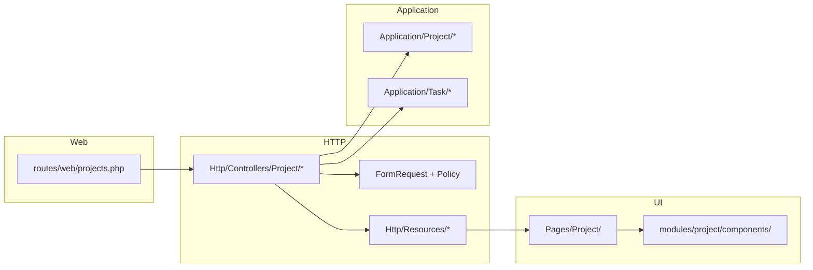
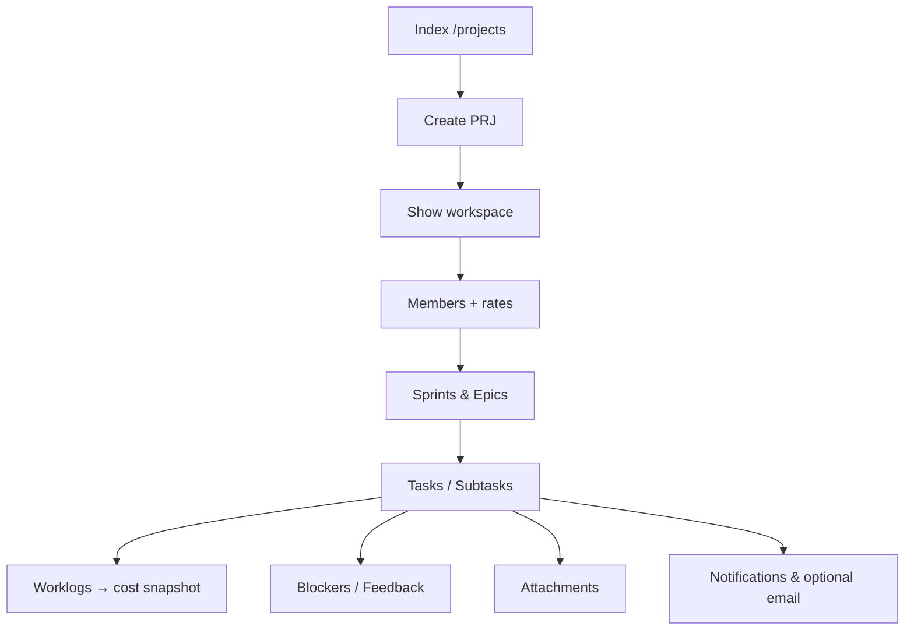

# Quản lý dự án — `/projects`

> **VA-QLDA** — module **Công việc & Dự án** trên sidebar: danh mục dự án, workspace chi tiết (Sprint, Kanban, tài liệu, vướng mắc & phản hồi nhúng).
> **Production:** `https://projects.vaschools.edu.vn/projects` (Inertia, guard `system`).
> **Trạng thái:** ✅ Triển khai đầy đủ — routes trong `routes/web/projects.php`, UI `Pages/Project/*` + `modules/project/`.

**Liên quan:** Vướng mắc toàn cục `/blockers` · Phản hồi `/feedback` · Báo cáo ngày (liên kết dự án) → `docs/DAILY_REPORT_PROJECTS.md` · Excel → `docs/IMPORT_EXPORT_RECONCILE.md`.

---

## 1. Mục tiêu & phạm vi

| Mục tiêu | Mô tả |
|---|---|
| Danh mục dự án | Lọc, KPI portfolio, bảng + Kanban theo loại / đội CNTT |
| Workspace dự án | Một URL `/projects/{id}` — tab Tổng quan, Tài liệu, Lịch, Kanban, Sprint, Vướng mắc, Phản hồi |
| Kế hoạch Agile | Sprint, epic, backlog, kéo-thả trạng thái, nhập Excel công việc (bulk) |
| Chi phí nhân công | Worklog trên task + `rate_snapshot` theo `project_member` |
| Cộng tác | Comment đa hình trên task, watcher, activity feed, email tổng hợp (tuỳ cấu hình) |
| Tài liệu | Upload phân loại (BA, UI/UX, khách hàng, showcase cổng Công nghệ) |

**Ngoài prefix `/projects` (module riêng nhưng gắn `project_id`):**

- `GET /blockers` — danh sách vướng mắc toàn hệ thống; tạo/sửa từ tab dự án gọi cùng API `BlockerController`.
- `GET /feedback` — góp ý toàn hệ thống; tab Phản hồi trên dự án lọc theo `project_id`.

---

## 2. Kiến trúc

### 2.1 Luồng request

| Lớp | Trách nhiệm | Path |
|---|---|---|
| Routes | Prefix `projects.`, segment tĩnh trước `/{project}` | `routes/web/projects.php` |
| Controller | Mỏng: `authorize`, gọi Use Case / query, Inertia | `app/Http/Controllers/Project/` |
| Application | Index/show aggregate, CRUD dự án, duplicate, archive, log work | `app/Application/Project/` |
| Task mutations | Create, update, patch status, bulk, import | `app/Application/Task/` |
| Policy | `view` / `manage` / `contribute` + manager/member | `app/Policies/ProjectPolicy.php` |
| Support | Activity, notification fan-out, email queue | `ProjectActivityLogger`, `NotificationDispatcher`, `TaskEmailService` |
| Frontend pages | 4 page Inertia | `resources/js/Pages/Project/` |
| Frontend module | Sprint, Dashboard, Documents, … | `resources/js/modules/project/` |
| Composables | Excel sprint, export danh mục, dashboard | `resources/js/composables/useProject*.js`, `useSprint*.js`, `useRisk*.js` |

### 2.2 Use Case (dự án)

| Use Case | Mục đích |
|---|---|
| `CreateProjectUseCase` | Tạo dự án, gợi ý mã `PRJ-xxx` |
| `UpdateProjectUseCase` | Cập nhật metadata + log thay đổi |
| `DuplicateProjectUseCase` | Nhân bản metadata (không copy task/sprint) |
| `ArchiveProjectUseCase` | `status=completed`, `is_active=false` (controller có method; **chưa** đăng ký route web) |
| `ProjectIndexQuery` | Paginate + filter server + KPI `summary` |
| `ProjectShowDataLoader` | Eager-load toàn bộ graph show (task nested) |
| `ProjectMemberRosterMerger` | Gộp roster phòng ban vào members hiển thị |
| `ProjectSummaryQuery` | KPI strip Index (total/active/completed/overdue) |
| `LogWorkUseCase` | Worklog + snapshot rate/cost |

---

## 3. Phân quyền

### 3.1 Policy `ProjectPolicy`

| Ability | Điều kiện |
|---|---|
| `viewAny` | Mọi account đăng nhập |
| `view` | Permission `project.view` **hoặc** là `manager_id` **hoặc** có trong `project_member` (active) |
| `create` | `project.create` |
| `update` | `project.update` **hoặc** là quản lý dự án |
| `delete` | `project.delete` (mặc định chỉ admin — xem ma trận) |
| `manage` | `project.manage` **hoặc** quản lý — sprint, member, xoá worklog, email |
| `contribute` | `project.contribute` **hoặc** `manage` **hoặc** thành viên — tạo/sửa task, ghi giờ, Kanban |

Ma trận RBAC runtime có thể ghi đè default trong `system_settings` (`permissions.role_grants`) — xem `docs/SYSTEM_CONFIG.md`, `docs/PERMISSIONS.md`.

### 3.2 Grant mặc định (`PermissionCatalog`)

| Role | Project permissions |
|---|---|
| `admin` | Toàn bộ key admin (gồm `project.*`) |
| `lead` | view, create, update, manage, contribute |
| `member` | *Không* grant `project.view` mặc định — vẫn xem được dự án nếu là manager/member (policy) |
| `viewer` | `project.view` |

### 3.3 Frontend

`ProjectResource` trả `can.update`, `can.delete`, `can.manage`, `can.contribute` — component dùng `project.can?.manage` / `canContribute`.

---

## 4. Trang danh mục — `GET /projects`

**Page:** `Project/Index.vue` · **Controller:** `ProjectController@index` · **Query:** `ProjectIndexQuery`.

### 4.1 KPI strip

`ProjectPortfolioSummaryBar` — prop `summary` từ `ProjectSummaryQuery`: `total`, `active`, `completed`, `overdue` (quá hạn: `due_date` &lt; hôm nay và status ∉ completed/cancelled). Thẻ bấm → lọc nhanh qua query Inertia.

### 4.2 Toolbar & lọc

Pattern datagrid: `DatagridToolbarSearch` (`hide-label`, `inline-actions`), Lọc/Cột/Xuất, segmented **Bảng | Kanban**.

**Query server** (`ProjectIndexQuery`):

| Param | Mô tả |
|---|---|
| `q` | Tìm `name`, `code` |
| `status` | `ProjectStatus` |
| `type` | `ProjectType` (cột vòng đời Kanban) |
| `category` | `hardware` \| `software` |
| `scope` | `ProjectScope` |
| `department_id` | Phòng ban sở hữu |
| `mine` | `1` — manager hoặc member của user |
| `per_page` | 5, 10, 15, 20, 50, 100 (mặc định 100) |

**Lọc client** (Index, không gửi server): `region`, `manager_id` — áp trên tập đã paginate.

Kanban nhóm theo `type` hoặc **đội CNTT** của quản lý (`EmployeeOrgTeamMap` → `org_team` trên từng dự án).

### 4.3 Xuất

`useProjectListExport` — CSV/Excel styled từ dữ liệu trang hiện tại.

### 4.4 Hành động

- **Tạo dự án** → `/projects/create` (cần `create`).
- Hàng lưới: sửa nhanh loại/phòng ban (`PATCH type`, `PATCH department`), nhân bản, xoá (policy).

---

## 5. Tạo & chỉnh sửa dự án

| Route | Page | Ghi chú |
|---|---|---|
| `GET /projects/create` | `Create.vue` | `ProjectForm`, mã gợi ý, phòng ban mặc định |
| `POST /projects` | — | `StoreProjectRequest` → `CreateProjectUseCase`; flash «Đã tạo dự án»; `after=continue` → edit |
| `GET /projects/{id}/edit` | `Edit.vue` | Cần `update` |
| `PUT /projects/{id}` | — | `UpdateProjectUseCase` |

### 5.1 Trường chính

| Trường | Enum / FK | Ghi chú |
|---|---|---|
| `code` | unique | VD `PRJ-001` |
| `name`, `description`, `color` | | Màu header/card |
| `status` | planning, active, on_hold, completed, cancelled | |
| `type` | rnd, deployment, operation | Vòng đời — cột Kanban danh mục |
| `category` | hardware, software | Phần cứng / Phần mềm |
| `scope` | headquarters, system, regional, departmental | Kèm `scope_regions[]`, `scope_departments[]` khi cần |
| `start_date`, `due_date` | | |
| `budget`, `actual_budget` | | Kế hoạch vs thực tế |
| `manager_id` | employees | Chủ dự án |
| `department_id` | departments | Phòng ban sở hữu |
| `is_active`, `sort_order` | | Sắp xếp danh mục |

### 5.2 Thao tác đặc biệt

| Route | Quyền | Hành vi |
|---|---|---|
| `POST /projects/{id}/duplicate` | `create` | Bản sao metadata, tên «(bản sao)», status planning → redirect edit |
| `DELETE /projects/{id}` | `delete` | Xoá cascade theo DB; về Index |

---

## 6. Workspace chi tiết — `GET /projects/{project}`

**Page:** `Project/Show.vue` · **Loader:** `ProjectShowDataLoader` · **Header:** `PageHeader` icon `projects`, subtitle `mã · trạng thái`.

### 6.1 Props Inertia chính

| Prop | Nguồn |
|---|---|
| `project` | `ProjectResource` (+ members, can) |
| `summary` | progress, counts members/tasks/sprints/blockers |
| `sprints`, `tasks`, `epics`, `blockers`, `feedbacks` | Collections Resource |
| `attachments` | Tài liệu dự án |
| `feedbackSummary` | open, resolved, avg_rating |
| `activityFeed` | `ProjectActivityFeedBuilder` |
| `options` | employees, enums |

**Deep link task:** `?task={id}` mở panel chi tiết; `?discussion=1` tab cộng tác. Route legacy `GET /projects/{p}/tasks/{t}` redirect về show + query (`TaskController@show`).

### 6.2 Các tab

| Tab | Key | Component chính |
|---|---|---|
| Tổng quan | `overview` | `ProjectShowSummaryBar`, `ProjectOverviewCard`, `WorkloadTable`, `ActivityFeed`, `GanttMini`, `RiskIssuePanel` |
| Tài liệu | `documents` | `ProjectDocumentsPanel`, preview Google/ file |
| Lịch dự án | `timeline` | `ProjectCalendar` — Gantt mini, kéo ngày → `PUT tasks` |
| Kanban | `board` | `TaskBoard` — `PATCH tasks.status` |
| Sprint | `sprints` | `SprintWorkspace` — list/calendar, `SprintDataModal` |
| Vướng mắc | `blockers` | `RiskIssueDataTable`, `RiskImportModal` |
| Phản hồi | `feedback` | `ProjectFeedbackPanel` |

`ProjectShowSummaryBar`: 5 KPI (tiến độ, thành viên, công việc, sprint, vướng mắc) — emit điều hướng tab.

---

## 7. Sprint

| Method | Route name | Mô tả |
|---|---|---|
| POST | `projects.sprints.store` | Tạo sprint (`sort_order` tự tăng) |
| PUT | `projects.sprints.update` | Sửa tên, goal, ngày, status |
| DELETE | `projects.sprints.destroy` | Xoá + renumber sort |
| PATCH | `projects.sprints.reorder` | Kéo thứ tự sprint |

**UI:** `SprintWorkspace.vue` — chế độ danh sách / lịch; `SprintTaskTable`, kéo task giữa sprint/backlog.

**Email:** `POST projects.email.sprint-summary` — queue email tổng hợp sprint (`TaskEmailService`, cần bật email hệ thống).

---

## 8. Công việc (Task)

| Method | Route | Mô tả |
|---|---|---|
| POST | `projects.tasks.store` | Tạo task |
| POST | `projects.tasks.bulk` | Nhiều dòng title + defaults |
| POST | `projects.tasks.import` | **Bulk Excel** — `ImportTaskRequest`, max 200, `ImportTasksUseCase` |
| POST | `projects.tasks.subtasks.store` | Con 1 cấp — kế thừa sprint/phase/ngày/gán từ cha |
| PUT | `projects.tasks.update` | Full update + dependencies + assignees |
| PATCH | `projects.tasks.status` | Kanban / order / sprint_id / progress |
| DELETE | `projects.tasks.destroy` | Soft delete |
| GET | `projects.tasks.show` | Redirect show + `?task=` |

**Panel:** `TaskDetailPanel` — mô tả rich (TipTap), subtask, worklog, attachment, comment thread.

**Hoàn thành:** `TaskCompleteModal` + `useTaskCompleteModal` — khóa chỉnh sửa khi done (trừ reopen theo rule).

**Epic:** `POST projects.epics.store` — nhãn nhóm trên board/sprint.

**Watcher:** `POST projects.tasks.watchers.toggle`.

**Task attachment:** `POST` / `DELETE` under `tasks/{task}/attachments`.

Enum task: `TaskStatus`, `TaskPriority`, phase SDLC — mirror trong `Options::enums()` cho form.

---

## 9. Worklog & chi phí

| Method | Route | Quyền |
|---|---|---|
| POST | `projects.worklogs.store` | `contribute` — `StoreWorklogRequest` → `LogWorkUseCase` |
| DELETE | `projects.worklogs.destroy` | `manage` |

**Quy tắc:** Rate lấy từ pivot `project_member` (`hourly` hoặc `monthly` ÷ `Project::monthlyHours()`). Lưu `rate_snapshot` + `cost` trên `worklogs` — không tính lại khi sửa rate sau.

`ProjectResource.labor_cost` / `progress()` trên model — tổng hợp hiển thị Cost trên UI.

---

## 10. Thành viên dự án

| Method | Route | Quyền |
|---|---|---|
| POST | `projects.members.store` | `manage` |
| PUT | `projects.members.update` | `manage` |
| DELETE | `projects.members.destroy` | `manage` |

Pivot `project_member`: `role`, `rate_type`, `rate`, `allocation`, `joined_at`, `is_active`.

UI: `ProjectMembers.vue`, `MemberFormModal` — thêm từ `ProjectActions` trên Show.

---

## 11. Tài liệu dự án

| Method | Route | Mô tả |
|---|---|---|
| POST | `projects.attachments.store` | Upload disk `public` — `projects/{id}/{category}` |
| PUT | `projects.attachments.update` | Metadata |
| DELETE | `projects.attachments.destroy` | |
| GET | `projects.attachments.file` | Stream file — **URL qua route**, `PublicMediaUrl`; null nếu mất file |

**Category** (`ProjectAttachmentCategory`): customer, uiux, ba, customer_data, images, showcase (ảnh cổng `/congnghe`).

Activity: `project_attachment_activities` — log trên `ProjectDocumentsPanel`.

---

## 12. Vướng mắc & phản hồi (trong dự án)

### 12.1 Vướng mắc

Tab **Vướng mắc** dùng dữ liệu `blockers` đã load theo `project_id`. CRUD qua `BlockerController` (`/blockers`, …) — policy blocker + quyền dự án.

**Nhập Excel:** `RiskImportModal` + `useRiskImport.js` → `POST /blockers/import` (pattern production — xem `IMPORT_EXPORT_RECONCILE.md`).

### 12.2 Phản hồi

Tab **Phản hồi** — `feedbacks` + `feedbackSummary`. Tạo mới cần `can.feedbackCreate`. Link xem tất cả: `/feedback?project_id={id}`.

---

## 13. Email vận hành

| Route | Mô tả |
|---|---|
| `POST /projects/{project}/email/daily-summary` | Tổng hợp ngày (optional `sprint_id`) |
| `POST /projects/{project}/sprints/{sprint}/email/summary` | Tổng hợp sprint |

Điều kiện: `TaskEmailService::isEnabled()`, mẫu `EmailTemplate` active, nhân viên có email. Quyền: `manage` dự án.

---

## 14. Nhập · xuất · đối soát

| Phạm vi | Composable | Modal / UI | Backend |
|---|---|---|---|
| Danh mục dự án | `useProjectListExport` | Nút Xuất Index | Client-only |
| Sprint / task | `useSprintData.js`, `useSprintExport.js`, `useSprintReconcile.js` | `SprintDataModal.vue` (3 tab) | **Import:** `POST projects.tasks.import` (bulk ✅) |
| Vướng mắc tab dự án | `useRiskImport.js`, `useRiskExport.js` | `RiskImportModal.vue` | `POST /blockers/import` |

Marker sprint Excel: `VA_SPRINT_IMPORT_V1` — chi tiết cột trong composable.

---

## 15. Bảng route đầy đủ (`projects.*`)

| Method | URI | `name()` |
|---|---|---|
| GET | `/projects` | `projects.index` |
| GET | `/projects/create` | `projects.create` |
| POST | `/projects` | `projects.store` |
| GET | `/projects/{project}` | `projects.show` |
| GET | `/projects/{project}/edit` | `projects.edit` |
| PUT | `/projects/{project}` | `projects.update` |
| PATCH | `/projects/{project}/type` | `projects.type` |
| PATCH | `/projects/{project}/department` | `projects.department` |
| POST | `/projects/{project}/duplicate` | `projects.duplicate` |
| DELETE | `/projects/{project}` | `projects.destroy` |
| POST | `/projects/{project}/sprints` | `projects.sprints.store` |
| PATCH | `/projects/{project}/sprints/reorder` | `projects.sprints.reorder` |
| PUT | `/projects/{project}/sprints/{sprint}` | `projects.sprints.update` |
| DELETE | `/projects/{project}/sprints/{sprint}` | `projects.sprints.destroy` |
| POST | `/projects/{project}/email/daily-summary` | `projects.email.daily-summary` |
| POST | `/projects/{project}/sprints/{sprint}/email/summary` | `projects.email.sprint-summary` |
| GET | `/projects/{project}/tasks/{task}` | `projects.tasks.show` |
| POST | `/projects/{project}/tasks` | `projects.tasks.store` |
| POST | `/projects/{project}/tasks/bulk` | `projects.tasks.bulk` |
| POST | `/projects/{project}/tasks/import` | `projects.tasks.import` |
| POST | `/projects/{project}/tasks/{task}/subtasks` | `projects.tasks.subtasks.store` |
| PUT | `/projects/{project}/tasks/{task}` | `projects.tasks.update` |
| PATCH | `/projects/{project}/tasks/{task}` | `projects.tasks.status` |
| DELETE | `/projects/{project}/tasks/{task}` | `projects.tasks.destroy` |
| POST | `/projects/{project}/tasks/{task}/watchers/toggle` | `projects.tasks.watchers.toggle` |
| POST | `/projects/{project}/tasks/{task}/attachments` | `projects.tasks.attachments.store` |
| DELETE | `/projects/{project}/tasks/{task}/attachments/{attachment}` | `projects.tasks.attachments.destroy` |
| POST | `/projects/{project}/epics` | `projects.epics.store` |
| POST | `/projects/{project}/tasks/{task}/worklogs` | `projects.worklogs.store` |
| DELETE | `/projects/{project}/tasks/{task}/worklogs/{worklog}` | `projects.worklogs.destroy` |
| GET | `/projects/{project}/attachments/{attachment}/file` | `projects.attachments.file` |
| POST | `/projects/{project}/attachments` | `projects.attachments.store` |
| PUT | `/projects/{project}/attachments/{attachment}` | `projects.attachments.update` |
| DELETE | `/projects/{project}/attachments/{attachment}` | `projects.attachments.destroy` |
| POST | `/projects/{project}/members` | `projects.members.store` |
| PUT | `/projects/{project}/members/{employee}` | `projects.members.update` |
| DELETE | `/projects/{project}/members/{employee}` | `projects.members.destroy` |

> Bảng canonical ngắn gọn cũng có trong `docs/API_STRUCTURE.md` §2.4–2.10.

---

## 16. Dữ liệu (Project domain)

Bảng `va_prd_*`: `projects`, `project_member`, `sprints`, `epics`, `tasks` (+ assignees, watchers, attachments, activities, dependencies), `worklogs`, `project_attachments`, `project_attachment_activities`.

Chi tiết cột: `docs/DATABASE_STRUCTURE.md` §3.4–3.12. **Lưu ý:** `projects.category` (hardware/software) — migration `2026_06_19_100000_add_category_to_projects_table.php`. Enum `ProjectType` trong code: `rnd`, `deployment`, `operation` (cập nhật doc DB nếu còn giá trị legacy trong bảng cũ).

---

## 17. Luồng nghiệp vụ (tóm tắt)

---

## 18. Tích hợp chéo

| Hệ thống | Cách gắn |
|---|---|
| Báo cáo ngày | Task sync / picker dự án — `DAILY_REPORT_PROJECTS.md` |
| Thông báo in-app | `NotificationDispatcher` (tạo dự án, member, sprint, task, import…) |
| Cổng Công nghệ | Attachment `showcase` + public project card |
| Comments | `CommentController` morph trên Task (panel collaboration) |
| Performance / Work dashboard | KPI tổng hợp từ task/project — `PERFORMANCE_ANALYTICS.md`, `/work` |
| Việc của tôi (`/my-work`) | Tập trung task cá nhân đa dự án (bucket Quá hạn/Hôm nay/Sắp tới/Chưa hạn), quick status + worklog tái dùng `projects.tasks.status` & `projects.worklogs.store`; lead xem việc thành viên nhóm (RBAC `my_work.view_team`/`my_work.act_team`, phạm vi `LedTeamScope`). Read-aggregation: `app/Application/Work/MyWorkQuery`, `MyWorkController`, widget trên `/work`. Đổi status hộ qua `TaskPolicy@changeStatus` (additive) |

---

## 19. File tham chiếu nhanh

| Vai trò | Path |
|---|---|
| Routes | `routes/web/projects.php` |
| Project CRUD | `app/Http/Controllers/Project/ProjectController.php` |
| Task / Sprint / Member / Attachment / Worklog / Email | `app/Http/Controllers/Project/*.php` |
| Policy | `app/Policies/ProjectPolicy.php` |
| Resources | `ProjectResource`, `ProjectListResource`, `TaskResource`, `SprintResource`, … |
| Pages | `resources/js/Pages/Project/{Index,Create,Edit,Show}.vue` |
| Module UI | `resources/js/modules/project/components/**` |
| Cột bảng Index | `resources/js/modules/project/config/columns.js` |
| Nav sidebar | `app/Support/Navigation.php` (nhóm «Công việc & Dự án») |

---

## 20. Checklist cập nhật doc

Khi đổi route, enum, tab UI hoặc import:

1. `routes/web/projects.php` ↔ mục §15 file này + `API_STRUCTURE.md` §2.4–2.10.
2. Migration / cột ↔ `DATABASE_STRUCTURE.md` §3.4+.
3. Component/page mới ↔ `FRONTEND_STRUCTURE.md` §6.3.
4. Excel ↔ `IMPORT_EXPORT_RECONCILE.md` bảng §1.
5. Luồng tổng ↔ `FLOWS_AND_DOCS_MAP.md` §6–7.
